---
output:
  knitrBootstrap::bootstrap_document:
    theme: readable
    highlight: zenburn
    theme.chooser: TRUE
    highlight.chooser: TRUE
  html_document:
    toc: true
    highlight: zenburn
---

Last updated Mon Oct 26 13:17:02 2015 by Lorena Pantano


```r
> library(knitr)
> 
> library(ggplot2)
> library(reshape)
> library(DESeq2)
> library(genefilter)
> library(CHBUtils)
> library(gtools)
> library(gridExtra)
> library(devtools)
> library(dplyr)
> library(pheatmap)
> 
> knitr::opts_chunk$set(tidy = TRUE, highlight = TRUE, dev = "png", fig.width = 9, 
+     fig.heigh = 6, cache = FALSE, highlight = TRUE, autodep = TRUE, warning = FALSE, 
+     error = FALSE, message = FALSE, prompt = TRUE, comment = "", fig.cap = "", 
+     bootstrap.show.code = FALSE)
> .cor = function(d) {
+     as.dist(1 - cor(d, method = "spearman"))
+ }
```


```r
> raw = read.table("BWH_3_Plate_parsed_QualityControlled.csv", header = T, sep = "\t", 
+     row.names = 1)
> raw = raw[2:nrow(raw), ]
> raw = raw[rowSums(raw) > 0, ]
> meta = read.table("metadata.csv", header = T, sep = "\t")
> row.names(meta) = colnames(raw)
> meta = meta[, c(2, 6, 8)]
```


# QC plots of raw data

## Total counts for each sample

```r
> df = data.frame(counts = colSums(raw), samples = colnames(raw), treatment = meta$Treatment)
> ggplot(df, aes(x = samples, y = counts, fill = treatment)) + geom_bar(stat = "identity") + 
+     theme(axis.text = element_text(angle = 90, hjust = 1))
```

 

## Clustering of raw counts

```r
> mds(raw, d = "cor", condition = meta$Treatment)
```

 

## Cumulative curve

```r
> ma_cum = do.call(cbind, lapply(raw, function(x) {
+     cumsum(sort(x, decreasing = T))/sum(x)
+ })) %>% as.data.frame()
> ma_cum$pos = 1:nrow(ma_cum)
> ggplot(melt(ma_cum, id.vars = "pos"), aes(x = pos, y = value, group = variable)) + 
+     geom_point() + ylab("pct of total reads") + xlab("ranked position of miRNA")
```

 

## Heatmap of raw counts

below are the boxplot of the raw counts for positve and negative probes.


```r
> pheatmap(log2(raw + 0.5), annotation = meta, clustering_distance_col = .cor(log2(raw + 
+     0.5)), clustering_method = "ward.D2", show_rownames = F)
```

 

```r
> positive = grepl("POS", rownames(raw))
> negative = grepl("ANT", rownames(raw))
> hk = grepl("HK", rownames(raw))
> mirs = grepl("miR", rownames(raw)) | grepl("let", rownames(raw))
> 
> dd = melt(raw %>% mutate(id = rownames(raw)), id.vars = "id")
> dd$group = meta[dd$variable, "Treatment"]
> 
> ggplot(dd %>% filter(grepl("POS", id))) + geom_boxplot(aes(y = value, x = variable, 
+     fill = group)) + ggtitle("Positive probes")
```

 

```r
> ggplot(dd %>% filter(grepl("ANT", id))) + geom_boxplot(aes(y = value, x = variable, 
+     fill = group)) + ggtitle("Negative probes") + theme(axis.text = element_text(angle = 90, 
+     hjust = 1))
```

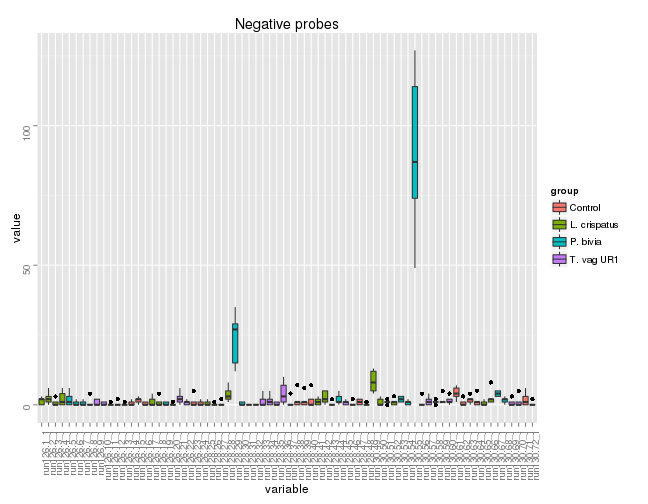 

Only one sample has a lot of noise in the negative probes. Remove sample 55 (  P. bivia  replicate).

# Normalization

Kept miRNAs with average counts > 70 in any group.

```r
> library(DESeq2)
> 
> no_pooled = !grepl("Pool", meta$Experimentdate)
> clean_meta = meta
> clean_meta$Treatment = gsub(" ", "", clean_meta$Treatment)
> group = as.character(unique(clean_meta$Treatment[no_pooled]))
> clean_raw = raw[grepl("-", rownames(raw)), ]
> cpm = clean_raw
> 
> keep = lapply(group, function(g) {
+     .is = clean_meta$Treatment == g
+     .count_group = rowMeans(cpm[, .is])
+     .count_group > 70
+ })
> idx = apply(do.call(cbind, keep), 1, any)
> all = do.call(cbind, keep)
> colnames(all) = gsub(" ", "", group)
> 
> # mirs = grepl('miR', rownames(raw_f)) | grepl('let', rownames(raw_f))
> raw_f = clean_raw[idx, ]
> dse = DESeqDataSetFromMatrix(raw_f, meta, ~Treatment)
> dse = estimateSizeFactors(dse)
> rlg = rlog(dse)
> # save(rlg,file='rlg.rda') load('rls.rda')
```

Total mirnas 386

## Distribution

```r
> df = melt(assay(rlg))
> df$group = meta$Treatment[match(df$X2, rownames(meta))]
> df$experiment = meta$Experimentdate[match(df$X2, rownames(meta))]
> ggplot(df, aes(x = value, group = X2, color = group)) + geom_density() + facet_wrap(~experiment)
```

 

## Clustering

```r
> ma = assay(rlg)
> mds(ma, d = "cor", condition = meta$Treatment)
```

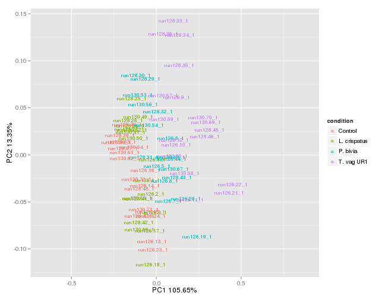 

## Heatmap

```r
> meta$Total = log10(colSums(raw_f))
> 
> pheatmap(ma, annotation = meta, clustering_distance_col = .cor(ma), clustering_method = "ward.D2", 
+     show_rownames = FALSE)
```

 

```r
> # pheatmap(ma[positive,], annotation = meta,
> # clustering_distance_col='correlation', clustering_method = 'ward.D2')
```

## Pooled samples

Sorted by average expression.

### All conditions

```r
> pooled = grepl("Pool", meta$Experimentdate)
> pool_cpm = ma[, pooled]
> pool_meta = meta[pooled, ]
> pool_sort = pool_cpm[order(rowMeans(pool_cpm), decreasing = TRUE), ]
> 
> pheatmap(cor(pool_cpm, method = "kendall"), clustering_method = "ward.D2", annotation = pool_meta)
```

 

```r
> pheatmap(pool_sort, annotation = pool_meta, clustering_distance_col = .cor(pool_sort), 
+     clustering_method = "ward.D2", show_rownames = FALSE)
```

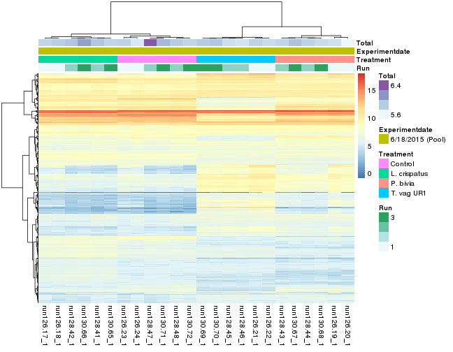 

```r
> pheatmap(pool_sort, annotation = pool_meta[, "Treatment", drop = F], cluster_rows = FALSE, 
+     clustering_distance_col = .cor(pool_sort), clustering_method = "ward.D2", 
+     show_rownames = FALSE)
```

 

### Each condition

```r
> for (cond in unique(pool_meta$Treatment)) {
+     .cond = grepl(cond, pool_meta$Treatment)
+     .pool_cpm = pool_cpm[, .cond]
+     .pool_meta = pool_meta[.cond, ]
+     .pool_sort = .pool_cpm[order(rowMeans(.pool_cpm), decreasing = TRUE), ]
+     pheatmap(.pool_sort, annotation = .pool_meta, cluster_rows = FALSE, clustering_distance_col = .cor(.pool_sort), 
+         clustering_method = "ward.D2", show_rownames = FALSE, main = cond)
+     pheatmap(.pool_sort, cluster_rows = FALSE, clustering_distance_col = .cor(.pool_sort), 
+         clustering_method = "ward.D2", show_rownames = FALSE, main = cond)
+ }
```

 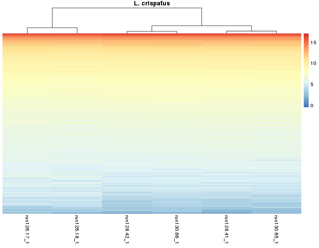 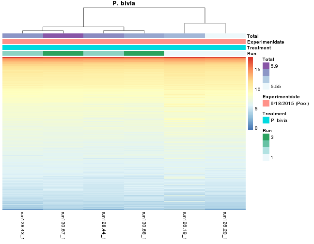   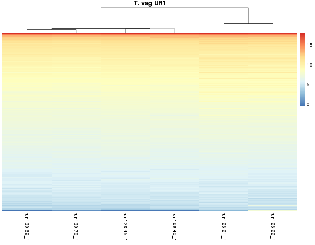  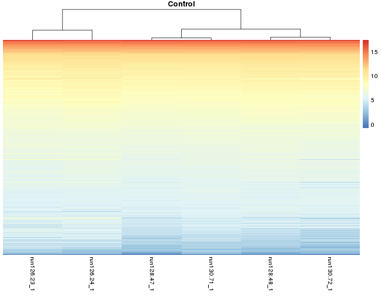 

## Not pooled samples

### All

```r
> pooled = !grepl("Pool", meta$Experimentdate)
> pool_cpm = ma[, pooled]
> pool_meta = meta[pooled, ]
> # pool_sort = pool_cpm[order(rowMeans(pool_cpm),decreasing = TRUE),]
> pheatmap(cor(pool_cpm, method = "kendall"), clustering_method = "ward.D2", annotation = pool_meta)
```

 

```r
> pheatmap(pool_cpm, annotation = pool_meta, clustering_distance_col = .cor(pool_cpm), 
+     clustering_method = "ward.D2", show_rownames = FALSE)
```

 

```r
> pheatmap(pool_cpm, annotation = pool_meta[, "Treatment", drop = F], clustering_distance_col = .cor(pool_cpm), 
+     clustering_method = "ward.D2", show_rownames = FALSE)
```

 

### Each condition

```r
> library(GGally)
> for (cond in unique(pool_meta$Treatment)) {
+     .cond = grepl(cond, pool_meta$Treatment)
+     .pool_cpm = pool_cpm[, .cond]
+     .pool_meta = pool_meta[.cond, ]
+     # .pool_sort = .pool_cpm[order(rowMeans(.pool_cpm),decreasing = TRUE),]
+     pheatmap(.pool_cpm, annotation = .pool_meta, clustering_distance_col = .cor(.pool_cpm), 
+         clustering_method = "ward.D2", show_rownames = FALSE, main = cond)
+     # dd_cor = data.frame(run1=rowMeans(.pool_cpm[,1:3]),
+     # run2=rowMeans(.pool_cpm[,4:6]), run3=rowMeans(.pool_cpm[,7:9]))
+     print(ggpairs(.pool_cpm))
+     
+     pheatmap(.pool_cpm, clustering_distance_col = .cor(.pool_cpm), clustering_method = "ward.D2", 
+         show_rownames = FALSE, main = cond)
+ }
```

  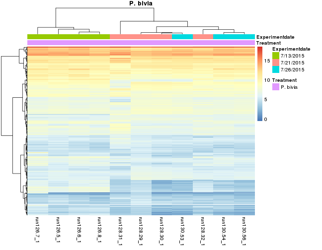  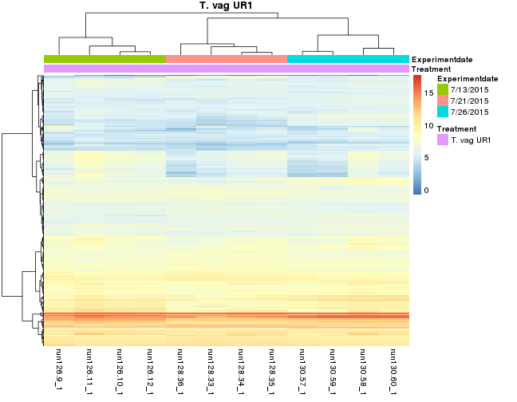 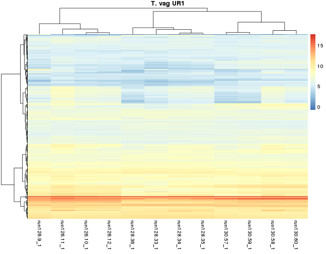  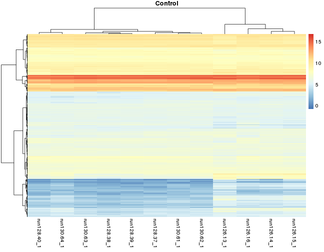     


## Differential expression

```r
> handle_deseq2 = function(dds, summarydata, column) {
+     all_combs = combn(levels(summarydata[, column]), 2, simplify = FALSE)
+     all_results = list()
+     contrast_strings = list()
+     for (comb in all_combs) {
+         if (comb[1] == "Control") 
+             comb = rev(comb)
+         contrast_string = paste(comb, collapse = "_vs_")
+         contrast = c(column, comb)
+         res = results(dds, contrast = contrast)
+         res = res[order(res$padj), ]
+         all_results = c(all_results, res)
+         contrast_strings = c(contrast_strings, contrast_string)
+     }
+     names(all_results) = contrast_strings
+     return(all_results)
+ }
> 
> plot_MA = function(res) {
+     for (i in seq(length(res))) {
+         DESeq2::plotMA(res[[i]])
+         title(paste("MA plot for contrast", names(res)[i]))
+     }
+ }
> 
> plot_volcano = function(res) {
+     for (i in seq(length(res))) {
+         stats = as.data.frame(res[[i]][, c(2, 6)])
+         p = volcano_density_plot(stats, title = names(res)[i], lfc.cutoff = 1)
+         print(p)
+     }
+ }
> plot_gene = function(name, d) {
+     design = colData(d)
+     ggplot(plotCounts(d, name, returnData = TRUE, intgroup = "Treatment", transform = TRUE) %>% 
+         mutate(run = as.factor(design$Run)), aes(x = Treatment, y = count, color = run)) + 
+         geom_point(size = 3) + ggtitle(name) + scale_color_brewer(palette = "Set1")
+ }
```


* Not including pooled samples


```r
> no_pooled = !grepl("Pool", clean_meta$Experimentdate)
> clean_meta$Treatment = relevel(factor(clean_meta$Treatment), ref = "Control")
> dse = DESeqDataSetFromMatrix(raw_f[, no_pooled], clean_meta[no_pooled, ], ~Treatment)
> dse = DESeq(dse)
> plotDispEsts(dse)
```

 

```r
> res = handle_deseq2(dse, colData(dse), "Treatment")
> plot_MA(res)
```

   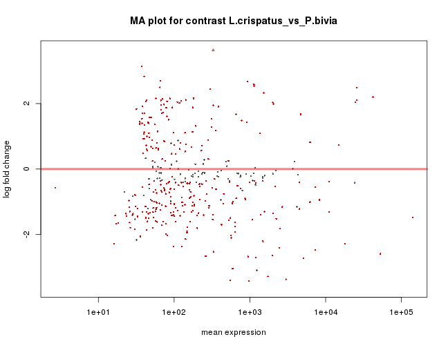  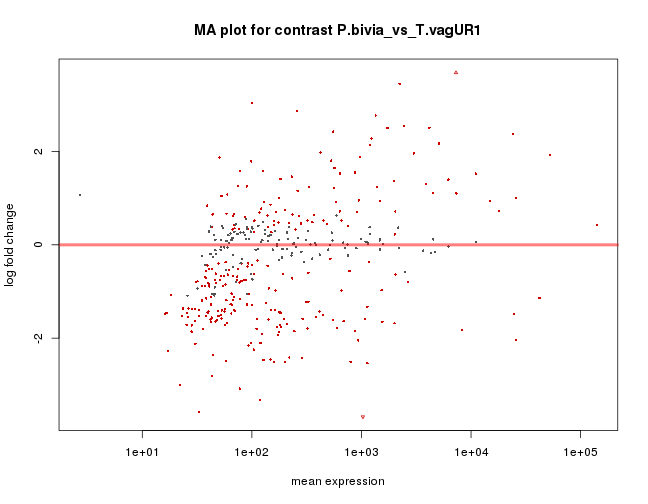 


```r
> for (i in names(res)) {
+     cat("\n\n###Top 20 at: ", i, "\n\n")
+     print(kable(head(res[[i]], 20)))
+     # top = (all_results[[i]] %>% mutate(mir=rownames(all_results[[i]])) %>%
+     # filter(padj<0.1))[,1:5]
+     cat("\n\n")
+     
+     stats = as.data.frame(res[[i]][, c(2, 6)])
+     p = volcano_density_plot(stats, title = i, lfc.cutoff = 1)
+     # suppressMessages(print(p))
+     cat("\n\n")
+     
+     # .plots = lapply(rownames(res[[i]][1:6,]), plot_gene, dse)
+     # do.call(grid.arrange, .plots)
+     i = gsub(" ", "", i)
+     res_tab = cbind(id = rownames(as.data.frame(res[[i]])), as.data.frame(res[[i]]))
+     write.table(res_tab, paste0(i, "_mirna_de.xls"), sep = "\t", quote = F, 
+         row.names = F)
+     cat("\n\n")
+     cat("[Download file](", get_report_links(paste0(i, "_mirna_de.xls")), ")", 
+         sep = "")
+     cat("\n\n")
+ }
```


###Top 20 at:  L.crispatus_vs_Control 


|            |   baseMean| log2FoldChange|     lfcSE|       stat|    pvalue|      padj|
|:-----------|----------:|--------------:|---------:|----------:|---------:|---------:|
|miR-3197    | 2658.14468|     -5.8347801| 0.3384949| -17.237424| 0.0000000| 0.0000000|
|miR-6845-5p |  587.00659|     -3.6928007| 0.2237036| -16.507563| 0.0000000| 0.0000000|
|miR-3178    | 3876.64250|     -1.2701697| 0.1949840|  -6.514226| 0.0000000| 0.0000000|
|miR-4284    |   49.29401|     -2.2108358| 0.3493298|  -6.328792| 0.0000000| 0.0000000|
|miR-4763-3p |  313.64382|     -1.1494756| 0.1952837|  -5.886182| 0.0000000| 0.0000003|
|miR-1260b   | 1496.30523|     -0.9943606| 0.1898658|  -5.237176| 0.0000002| 0.0000105|
|miR-762     | 2257.13612|     -1.0430367| 0.2025945|  -5.148397| 0.0000003| 0.0000145|
|miR-1273e   |  935.80389|      1.2701293| 0.2808020|   4.523220| 0.0000061| 0.0002351|
|miR-1915-3p | 1350.91302|     -1.1702915| 0.2568460|  -4.556393| 0.0000052| 0.0002351|
|miR-4651    |  489.64104|     -0.6283366| 0.1382609|  -4.544572| 0.0000055| 0.0002351|
|miR-5196-5p |   74.64871|     -0.7823900| 0.1788989|  -4.373364| 0.0000122| 0.0004293|
|miR-3135a   |  299.99706|      1.1221941| 0.2593513|   4.326927| 0.0000151| 0.0004490|
|miR-4463    |   98.93071|     -0.6470794| 0.1493987|  -4.331225| 0.0000148| 0.0004490|
|miR-6756-5p |   68.15189|     -0.6657426| 0.1576162|  -4.223821| 0.0000240| 0.0006623|
|miR-4488    | 7424.64392|     -0.8561753| 0.2076796|  -4.122577| 0.0000375| 0.0009641|
|miR-8072    | 1210.50532|     -0.9003242| 0.2242612|  -4.014624| 0.0000595| 0.0014364|
|miR-3665    |  644.84066|     -0.8847422| 0.2239019|  -3.951473| 0.0000777| 0.0017636|
|miR-1973    |   41.03472|     -1.3379229| 0.3463416|  -3.863015| 0.0001120| 0.0024017|
|miR-5787    | 2473.31723|     -0.8956031| 0.2379793|  -3.763366| 0.0001676| 0.0034058|
|miR-4271    | 2013.03373|     -1.4567532| 0.4000403|  -3.641516| 0.0002710| 0.0052310|


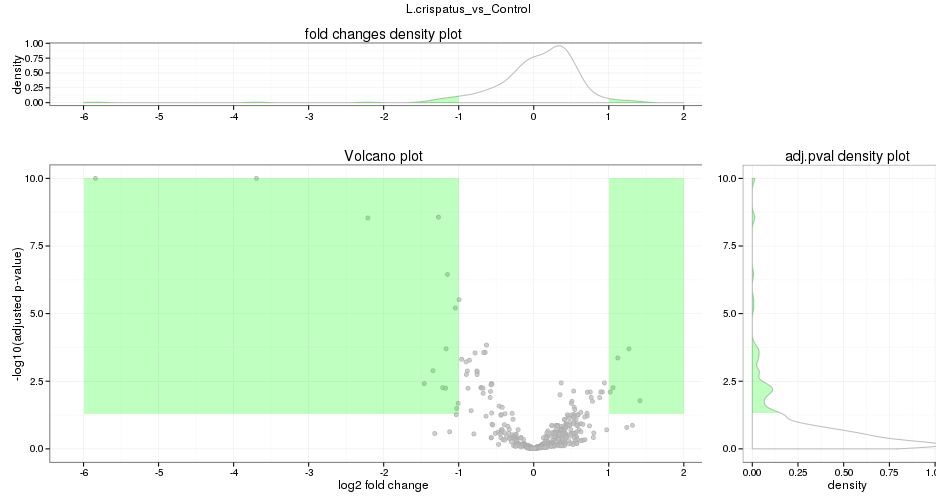 


[Download file](http://github.com/lpantano/scripts_hsph/raw/reports/riana_final/L.crispatus_vs_Control_mirna_de.xls)


###Top 20 at:  P.bivia_vs_Control 


|            |    baseMean| log2FoldChange|     lfcSE|       stat| pvalue| padj|
|:-----------|-----------:|--------------:|---------:|----------:|------:|----:|
|miR-6859-5p |   327.78307|     -4.6997376| 0.2381044| -19.738141|      0|    0|
|miR-3197    |  2658.14468|     -4.7671752| 0.3391676| -14.055517|      0|    0|
|miR-4763-3p |   313.64382|     -2.6764662| 0.2019121| -13.255602|      0|    0|
|miR-6845-5p |   587.00659|     -2.7042122| 0.2246659| -12.036597|      0|    0|
|miR-937-5p  |   177.13380|     -2.0939181| 0.1771233| -11.821811|      0|    0|
|miR-4448    | 25596.44861|     -2.6572885| 0.2298189| -11.562532|      0|    0|
|miR-4463    |    98.93071|     -1.7155363| 0.1600515| -10.718649|      0|    0|
|miR-6088    |    61.44546|      2.1800180| 0.2251565|   9.682234|      0|    0|
|miR-1915-3p |  1350.91302|     -2.3203515| 0.2580527|  -8.991774|      0|    0|
|miR-4440    |    38.14315|     -3.2541710| 0.3627188|  -8.971608|      0|    0|
|miR-4507    |   124.15959|     -2.0927766| 0.2372535|  -8.820847|      0|    0|
|miR-1290    |  1732.54876|      3.0671397| 0.3603733|   8.511008|      0|    0|
|miR-181c-5p |   106.42538|      2.0515780| 0.2489198|   8.241924|      0|    0|
|miR-920     |   129.47345|      2.0994574| 0.2573073|   8.159338|      0|    0|
|miR-3178    |  3876.64250|     -1.5661623| 0.1953365|  -8.017764|      0|    0|
|miR-1275    |   118.59128|     -1.4502404| 0.1835769|  -7.899906|      0|    0|
|miR-574-3p  |   658.49605|     -1.9422030| 0.2508277|  -7.743177|      0|    0|
|miR-210-3p  |   166.41183|      0.8314315| 0.1081684|   7.686456|      0|    0|
|miR-8072    |  1210.50532|      1.7223240| 0.2239474|   7.690751|      0|    0|
|miR-6886-3p |    61.48105|     -1.4546447| 0.1906664|  -7.629268|      0|    0|


 


[Download file](http://github.com/lpantano/scripts_hsph/raw/reports/riana_final/P.bivia_vs_Control_mirna_de.xls)


###Top 20 at:  T.vagUR1_vs_Control 


|            |    baseMean| log2FoldChange|     lfcSE|      stat| pvalue| padj|
|:-----------|-----------:|--------------:|---------:|---------:|------:|----:|
|miR-1915-3p |  1350.91302|      -5.026067| 0.2598701| -19.34069|      0|    0|
|miR-6846-5p |  1029.26227|       9.012255| 0.4717246|  19.10491|      0|    0|
|miR-210-3p  |   166.41183|       1.852193| 0.1029215|  17.99617|      0|    0|
|miR-181c-5p |   106.42538|       4.183758| 0.2411997|  17.34562|      0|    0|
|miR-6859-5p |   327.78307|      -3.764039| 0.2258259| -16.66788|      0|    0|
|miR-6845-5p |   587.00659|      -3.557639| 0.2238003| -15.89649|      0|    0|
|miR-4448    | 25596.44861|      -3.580100| 0.2297622| -15.58176|      0|    0|
|miR-181d-5p |    94.22351|       4.201746| 0.2720356|  15.44557|      0|    0|
|miR-762     |  2257.13612|      -2.965645| 0.2034007| -14.58031|      0|    0|
|miR-3178    |  3876.64250|      -2.787319| 0.1952365| -14.27663|      0|    0|
|miR-320b    |   178.43160|       3.048818| 0.2179710|  13.98727|      0|    0|
|miR-181b-5p |   121.21010|       3.958595| 0.2860492|  13.83886|      0|    0|
|miR-4429    |   212.63494|       3.081411| 0.2254949|  13.66511|      0|    0|
|miR-320c    |   171.95767|       3.030915| 0.2220614|  13.64899|      0|    0|
|miR-17-3p   |    59.43939|       3.730617| 0.2746969|  13.58084|      0|    0|
|miR-320a    |   246.45148|       3.125357| 0.2321816|  13.46083|      0|    0|
|miR-181a-5p |   287.95658|       4.209470| 0.3226126|  13.04806|      0|    0|
|miR-320e    |   164.49397|       2.772609| 0.2130309|  13.01506|      0|    0|
|miR-221-3p  |   869.11863|       3.023344| 0.2333616|  12.95562|      0|    0|
|miR-4463    |    98.93071|      -2.041436| 0.1577511| -12.94087|      0|    0|


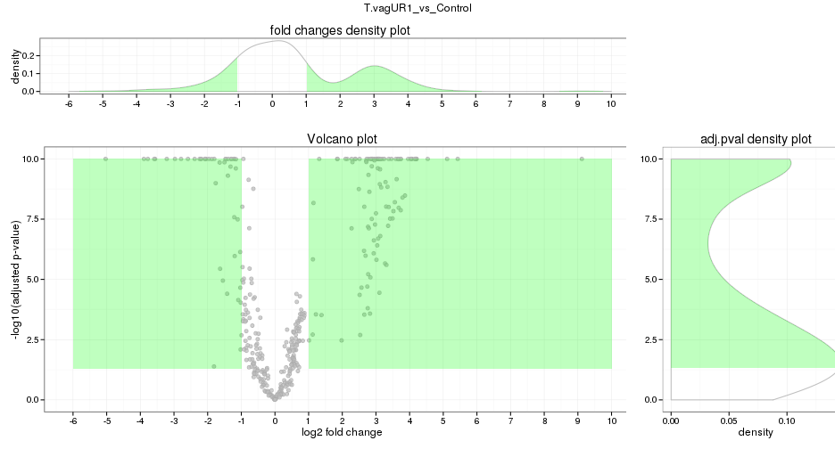 


[Download file](http://github.com/lpantano/scripts_hsph/raw/reports/riana_final/T.vagUR1_vs_Control_mirna_de.xls)


###Top 20 at:  L.crispatus_vs_P.bivia 


|             |    baseMean| log2FoldChange|     lfcSE|       stat| pvalue| padj|
|:------------|-----------:|--------------:|---------:|----------:|------:|----:|
|miR-6859-5p  |   327.78307|      3.9443723| 0.2383750|  16.546921|      0|    0|
|miR-8072     |  1210.50532|     -2.6226482| 0.2242705| -11.694130|      0|    0|
|miR-4488     |  7424.64392|     -2.4009626| 0.2076902| -11.560306|      0|    0|
|miR-1260b    |  1496.30523|     -2.1273007| 0.1900338| -11.194328|      0|    0|
|miR-4448     | 25596.44861|      2.5621554| 0.2298193|  11.148567|      0|    0|
|miR-1275     |   118.59128|      1.9511509| 0.1827694|  10.675478|      0|    0|
|miR-937-5p   |   177.13380|      1.8477048| 0.1773611|  10.417758|      0|    0|
|miR-1237-5p  |   576.79368|     -2.0351729| 0.2040004|  -9.976319|      0|    0|
|miR-5787     |  2473.31723|     -2.3284302| 0.2380195|  -9.782518|      0|    0|
|miR-1273e    |   935.80389|      2.7567732| 0.2834114|   9.727108|      0|    0|
|miR-3960     | 53355.49564|     -2.5085300| 0.2581692|  -9.716611|      0|    0|
|miR-6126     |  3042.66930|     -3.2833841| 0.3492366|  -9.401603|      0|    0|
|miR-3135a    |   299.99706|      2.4719756| 0.2643587|   9.350838|      0|    0|
|miR-6786-5p  |   645.68982|     -1.6929973| 0.1890740|  -8.954153|      0|    0|
|miR-920      |   129.47345|     -2.3084036| 0.2578756|  -8.951615|      0|    0|
|miR-7845-5p  |    33.46122|     -2.0397653| 0.2302119|  -8.860382|      0|    0|
|miR-1290     |  1732.54876|     -3.1622729| 0.3603910|  -8.774562|      0|    0|
|miR-1273h-5p |  1133.04690|      2.6687935| 0.3095780|   8.620746|      0|    0|
|miR-6850-5p  |   283.94433|      0.8959813| 0.1041232|   8.605009|      0|    0|
|miR-5585-3p  |  1529.48962|      2.4124828| 0.2818597|   8.559162|      0|    0|


 


[Download file](http://github.com/lpantano/scripts_hsph/raw/reports/riana_final/L.crispatus_vs_P.bivia_mirna_de.xls)


###Top 20 at:  L.crispatus_vs_T.vagUR1 


|            |    baseMean| log2FoldChange|     lfcSE|      stat| pvalue| padj|
|:-----------|-----------:|--------------:|---------:|---------:|------:|----:|
|miR-6846-5p |  1029.26227|      -9.054219| 0.4719375| -19.18521|      0|    0|
|miR-210-3p  |   166.41183|      -1.678519| 0.1018661| -16.47770|      0|    0|
|miR-4448    | 25596.44861|       3.484967| 0.2297625|  15.16769|      0|    0|
|miR-1915-3p |  1350.91302|       3.855775| 0.2599769|  14.83122|      0|    0|
|miR-1275    |   118.59128|       2.701523| 0.1835192|  14.72066|      0|    0|
|miR-181c-5p |   106.42538|      -3.420080| 0.2337941| -14.62860|      0|    0|
|miR-320b    |   178.43160|      -3.146523| 0.2182796| -14.41511|      0|    0|
|miR-320e    |   164.49397|      -3.002469| 0.2139440| -14.03390|      0|    0|
|miR-320a    |   246.45148|      -3.256252| 0.2325081| -14.00490|      0|    0|
|miR-320c    |   171.95767|      -3.070290| 0.2221266| -13.82225|      0|    0|
|miR-4429    |   212.63494|      -3.046341| 0.2252940| -13.52163|      0|    0|
|miR-181d-5p |    94.22351|      -3.576749| 0.2656369| -13.46481|      0|    0|
|miR-6859-5p |   327.78307|       3.008673| 0.2261121|  13.30612|      0|    0|
|miR-6850-5p |   283.94433|       1.330452| 0.1029943|  12.91773|      0|    0|
|miR-17-3p   |    59.43939|      -3.491815| 0.2714217| -12.86491|      0|    0|
|miR-181b-5p |   121.21010|      -3.533771| 0.2830794| -12.48332|      0|    0|
|miR-320d    |   150.09848|      -3.177257| 0.2645678| -12.00924|      0|    0|
|miR-149-5p  |    57.69226|      -3.015783| 0.2552800| -11.81363|      0|    0|
|miR-221-3p  |   869.11863|      -2.736744| 0.2331433| -11.73846|      0|    0|
|miR-193a-5p |    31.12074|      -3.462056| 0.3058041| -11.32115|      0|    0|


 


[Download file](http://github.com/lpantano/scripts_hsph/raw/reports/riana_final/L.crispatus_vs_T.vagUR1_mirna_de.xls)


###Top 20 at:  P.bivia_vs_T.vagUR1 


|            |    baseMean| log2FoldChange|     lfcSE|       stat| pvalue| padj|
|:-----------|-----------:|--------------:|---------:|----------:|------:|----:|
|miR-4488    |  7424.64392|       3.781341| 0.2078896|  18.189180|      0|    0|
|miR-6846-5p |  1029.26227|      -7.997330| 0.4716478| -16.956149|      0|    0|
|miR-762     |  2257.13612|       3.368661| 0.2035874|  16.546515|      0|    0|
|miR-6085    |   103.34965|       3.015064| 0.1866159|  16.156524|      0|    0|
|miR-8069    |   260.41532|       2.789371| 0.2113440|  13.198254|      0|    0|
|miR-6089    |  4217.42778|       2.421313| 0.2222968|  10.892253|      0|    0|
|miR-1915-3p |  1350.91302|       2.705715| 0.2611681|  10.360052|      0|    0|
|miR-5787    |  2473.31723|       2.458302| 0.2380870|  10.325226|      0|    0|
|miR-197-5p  |    76.07725|       1.236304| 0.1213590|  10.187165|      0|    0|
|miR-210-3p  |   166.41183|      -1.020762| 0.1027466|  -9.934748|      0|    0|
|miR-6771-5p |   120.06695|      -3.104790| 0.3371875|  -9.207902|      0|    0|
|miR-181c-5p |   106.42538|      -2.132180| 0.2324637|  -9.172099|      0|    0|
|miR-8072    |  1210.50532|       2.055163| 0.2241082|   9.170407|      0|    0|
|miR-320b    |   178.43160|      -1.907890| 0.2182747|  -8.740774|      0|    0|
|miR-4466    | 24327.27195|       2.271770| 0.2643416|   8.594068|      0|    0|
|miR-6727-5p |    78.80021|       1.529387| 0.1806274|   8.467085|      0|    0|
|miR-17-3p   |    59.43939|      -2.264452| 0.2687877|  -8.424686|      0|    0|
|miR-221-3p  |   869.11863|      -1.922828| 0.2338664|  -8.221909|      0|    0|
|miR-181d-5p |    94.22351|      -2.154980| 0.2635232|  -8.177573|      0|    0|
|miR-320a    |   246.45148|      -1.903284| 0.2325961|  -8.182785|      0|    0|


 


[Download file](http://github.com/lpantano/scripts_hsph/raw/reports/riana_final/P.bivia_vs_T.vagUR1_mirna_de.xls)

## Alternative strategy to detect ON/OFF

I think a valid strategy would be to do the 70 cut off by group.
So I keep mirnas that have average of 70 in any of the groups and then do the 
differential expression analysis. The ones with padj < 0.05 are good candidates 
to on/off assuming 70 as the cutoff for expression/non expression.


```r
> onoff_de = c()
> for (i in names(res)) {
+     if (grepl("Control", i)) {
+         .g = unlist(strsplit(i, "_"))
+         .g1 = match(.g[1], colnames(all))
+         .g2 = match(.g[3], colnames(all))
+         .onoff = row.names(res[[i]]) %in% rownames(all[rowSums(all[, c(.g1, 
+             .g2)]) == 1 & all[, .g2] == 0, ])
+         .res = res[[i]][.onoff, ]
+         .res = .res[.res$padj < 0.05, ]
+         cat("\n\n###", .g[3], ". Top 10 (total", nrow(.res), "):\n\n")
+         print(kable(head(.res, 10)))
+         cat("\n\n")
+         # top = (all_results[[i]] %>% mutate(mir=rownames(all_results[[i]])) %>%
+         # filter(padj<0.1))[,1:5] .plots = lapply(rownames(.res[1:3,]), plot_gene,
+         # dse) do.call(grid.arrange, .plots)
+         i = gsub(" ", "", i)
+         res_tab = cbind(id = rownames(as.data.frame(.res)), as.data.frame(.res))
+         write.table(res_tab, paste0(i, "_mirna_onoff_de.xls"), sep = "\t", quote = F, 
+             row.names = F)
+         cat("\n\n")
+         cat("[Download file](", get_report_links(paste0(i, "_mirna_onoff_de.xls")), 
+             ")", sep = "")
+         cat("\n\n")
+         onoff_de = c(onoff_de, rownames(.res[.res$padj < 0.05, ]))
+     }
+ }
```


### Control . Top 10 (total 1 ):


|           | baseMean| log2FoldChange|     lfcSE|     stat|    pvalue|      padj|
|:----------|--------:|--------------:|---------:|--------:|---------:|---------:|
|miR-605-3p | 79.98141|      0.5469183| 0.1964481| 2.784035| 0.0053687| 0.0383765|


[Download file](http://github.com/lpantano/scripts_hsph/raw/reports/riana_final/L.crispatus_vs_Control_mirna_onoff_de.xls)


### Control . Top 10 (total 60 ):


|            |  baseMean| log2FoldChange|     lfcSE|     stat| pvalue| padj|
|:-----------|---------:|--------------:|---------:|--------:|------:|----:|
|miR-6088    |  61.44546|       2.180018| 0.2251565| 9.682234|      0|    0|
|miR-181c-5p | 106.42538|       2.051578| 0.2489198| 8.241924|      0|    0|
|miR-7845-5p |  33.46122|       1.671523| 0.2265382| 7.378549|      0|    0|
|miR-181d-5p |  94.22351|       2.046766| 0.2800963| 7.307366|      0|    0|
|miR-378i    |  80.22392|       1.686775| 0.2400346| 7.027216|      0|    0|
|miR-422a    |  82.70819|       2.030447| 0.3128397| 6.490375|      0|    0|
|miR-4665-5p |  62.32422|       1.336450| 0.2093440| 6.383990|      0|    0|
|miR-181b-5p | 121.21010|       1.832838| 0.2925804| 6.264391|      0|    0|
|miR-378a-3p | 106.02171|       1.637842| 0.2619280| 6.253024|      0|    0|
|miR-6778-5p |  35.88353|       1.686721| 0.2760442| 6.110329|      0|    0|


[Download file](http://github.com/lpantano/scripts_hsph/raw/reports/riana_final/P.bivia_vs_Control_mirna_onoff_de.xls)


### Control . Top 10 (total 89 ):


|            |   baseMean| log2FoldChange|     lfcSE|     stat| pvalue| padj|
|:-----------|----------:|--------------:|---------:|--------:|------:|----:|
|miR-6846-5p | 1029.26227|       9.012255| 0.4717246| 19.10491|      0|    0|
|miR-181c-5p |  106.42538|       4.183758| 0.2411997| 17.34562|      0|    0|
|miR-181d-5p |   94.22351|       4.201746| 0.2720356| 15.44557|      0|    0|
|miR-181b-5p |  121.21010|       3.958595| 0.2860492| 13.83886|      0|    0|
|miR-17-3p   |   59.43939|       3.730617| 0.2746969| 13.58084|      0|    0|
|miR-149-5p  |   57.69226|       3.062269| 0.2560552| 11.95941|      0|    0|
|miR-125a-5p |  160.49024|       3.458458| 0.3123408| 11.07271|      0|    0|
|miR-96-5p   |   22.82305|       5.061718| 0.4696765| 10.77703|      0|    0|
|miR-100-5p  |   44.41199|       4.164833| 0.4082156| 10.20253|      0|    0|
|miR-378i    |   80.22392|       2.383356| 0.2350520| 10.13969|      0|    0|


[Download file](http://github.com/lpantano/scripts_hsph/raw/reports/riana_final/T.vagUR1_vs_Control_mirna_onoff_de.xls)


Heatmap with all onoff detected:


```r
> onoff_rlg = assay(rlog(dse))
> pheatmap(onoff_rlg[unique(onoff_de), ], clustering_distance_col = .cor(onoff_rlg), 
+     clustering_method = "ward.D2", annotation = clean_meta, show_rownames = FALSE, 
+     main = "ON/OFF mirnas")
```

 

```r
> pheatmap(onoff_rlg[unique(onoff_de), ], clustering_distance_col = .cor(onoff_rlg), 
+     clustering_method = "ward.D2", annotation = clean_meta[, "Treatment", drop = F], 
+     show_rownames = FALSE, main = "ON/OFF mirnas")
```

 


# Files requested

## heatmaps of pooled samples

[heatmap of pooled samples](http://github.com/lpantano/scripts_hsph/raw/reports/riana_final/figure/heatmap-pooled-2.png)

## heatmaps of non-pooled samples

### Each condition
[heatmap of non pooled samples from L.Crispatus](http://github.com/lpantano/scripts_hsph/raw/reports/riana_final/figure/heatmap-nopooled-condition-2.png)

[heatmap of non pooled samples from P.bivia](http://github.com/lpantano/scripts_hsph/raw/reports/riana_final/figure/heatmap-nopooled-condition-4.png)

[heatmap of non pooled samples from T.Vag UR1](http://github.com/lpantano/scripts_hsph/raw/reports/riana_final/figure/heatmap-nopooled-condition-6.png)

[heatmap of non pooled samples from Control](http://github.com/lpantano/scripts_hsph/raw/reports/riana_final/figure/heatmap-nopooled-condition-8.png)

### All together
[heatmap of non pooled samples all together](http://github.com/lpantano/scripts_hsph/raw/reports/riana_final/figure/heatmap-nopooled-2.png)

## Differential expression tables and volcano plots

[download table with differential expressed genes of L.crispatus_vs_Control](http://github.com/lpantano/scripts_hsph/raw/reports/riana_final/L.crispatus_vs_Control_mirna_de.xls)

[download volcano plot of L.crispatus_vs_Control_mirna_de.xls](http://github.com/lpantano/scripts_hsph/raw/reports/riana_final/figure/nonpooled-de-volcano-1.png)

[download table with differential expressed genes of L.crispatus_vs_P.bivia](http://github.com/lpantano/scripts_hsph/raw/reports/riana_final/L.crispatus_vs_P.bivia_mirna_de.xls)

[download volcano plot of L.crispatus_vs_P.bivia_mirna_de.xls](http://github.com/lpantano/scripts_hsph/raw/reports/riana_final/figure/nonpooled-de-volcano-2.png)

[download table with differential expressed genes of L.crispatus_vs_T.vagUR1](http://github.com/lpantano/scripts_hsph/raw/reports/riana_final/L.crispatus_vs_T.vagUR1_mirna_de.xls)

[download volcano plot of L.crispatus_vs_T.vagUR1_mirna_de.xls](http://github.com/lpantano/scripts_hsph/raw/reports/riana_final/figure/nonpooled-de-volcano-3.png)

[download table with differential expressed genes of P.bivia_vs_Control](http://github.com/lpantano/scripts_hsph/raw/reports/riana_final/P.bivia_vs_Control_mirna_de.xls)

[download volcano plot of P.bivia_vs_Control_mirna_de.xls](http://github.com/lpantano/scripts_hsph/raw/reports/riana_final/figure/nonpooled-de-volcano-4.png)

[download table with differential expressed genes of P.bivia_vs_T.vagUR1](http://github.com/lpantano/scripts_hsph/raw/reports/riana_final/P.bivia_vs_T.vagUR1_mirna_de.xls)

[download volcano plot of P.bivia_vs_T.vagUR1_mirna_de.xls](http://github.com/lpantano/scripts_hsph/raw/reports/riana_final/figure/nonpooled-de-volcano-5.png)

[download table with differential expressed genes of T.vagUR1_vs_Control](http://github.com/lpantano/scripts_hsph/raw/reports/riana_final/T.vagUR1_vs_Control_mirna_de.xls)

[download volcano plot of T.vagUR1_vs_Control_mirna_de.xls](http://github.com/lpantano/scripts_hsph/raw/reports/riana_final/figure/nonpooled-de-volcano-6.png)

## On/Off miRNAs

[download table with onn/off genes of L.crispatus_vs_Control_mirna](http://github.com/lpantano/scripts_hsph/raw/reports/riana_final/L.crispatus_vs_Control_mirna_onoff_de.xls)

[download table with onn/off genes of P.bivia_vs_Control_mirna](http://github.com/lpantano/scripts_hsph/raw/reports/riana_final/P.bivia_vs_Control_mirna_onoff_de.xls)

[download table with onn/off genes of T.vagUR1_vs_Control_mirna](http://github.com/lpantano/scripts_hsph/raw/reports/riana_final/T.vagUR1_vs_Control_mirna_onoff_de.xls)

