---
output:
  knitrBootstrap::bootstrap_document:
    theme: readable
    highlight: zenburn
    theme.chooser: TRUE
    highlight.chooser: TRUE
  html_document:
    toc: true
    highlight: zenburn
---

Last updated Thu Nov 12 14:29:58 2015 by Lorena Pantano


```r
> library(knitr)
> 
> library(ggplot2)
> library(reshape)
> library(DESeq2)
> library(genefilter)
> library(CHBUtils)
> library(gtools)
> library(gridExtra)
> library(devtools)
> library(dplyr)
> library(pheatmap)
> 
> knitr::opts_chunk$set(tidy = TRUE, highlight = TRUE, dev = "png", fig.width = 9, 
+     fig.heigh = 6, cache = FALSE, highlight = TRUE, autodep = TRUE, warning = FALSE, 
+     error = FALSE, message = FALSE, prompt = TRUE, comment = "", fig.cap = "", 
+     bootstrap.show.code = FALSE)
> .cor = function(d) {
+     as.dist(1 - cor(d, method = "spearman"))
+ }
```


```r
> raw = read.table("BWH_3_Plate_parsed_QualityControlled.csv", header = T, sep = "\t", 
+     row.names = 1)
> raw = raw[2:nrow(raw), ]
> raw = raw[rowSums(raw) > 0, ]
> meta = read.table("metadata.csv", header = T, sep = "\t")
> row.names(meta) = colnames(raw)
> meta = meta[, c(2, 6, 8)]
```


# QC plots of raw data

## Total counts for each sample

```r
> df = data.frame(counts = colSums(raw), samples = colnames(raw), treatment = meta$Treatment)
> ggplot(df, aes(x = samples, y = counts, fill = treatment)) + geom_bar(stat = "identity") + 
+     theme(axis.text = element_text(angle = 90, hjust = 1))
```

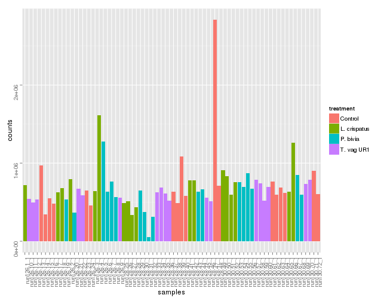 

## Clustering of raw counts

```r
> mds(raw, d = "cor", condition = meta$Treatment)
```

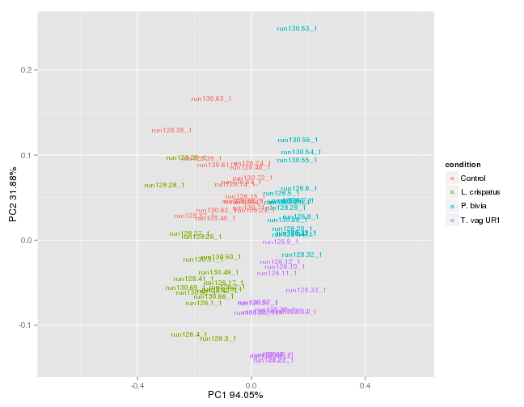 

## Cumulative curve

```r
> ma_cum = do.call(cbind, lapply(raw, function(x) {
+     cumsum(sort(x, decreasing = T))/sum(x)
+ })) %>% as.data.frame()
> ma_cum$pos = 1:nrow(ma_cum)
> ggplot(melt(ma_cum, id.vars = "pos"), aes(x = pos, y = value, group = variable)) + 
+     geom_point() + ylab("pct of total reads") + xlab("ranked position of miRNA")
```

 

## Heatmap of raw counts

below are the boxplot of the raw counts for positve and negative probes.


```r
> pheatmap(log2(raw + 0.5), annotation = meta, clustering_distance_col = .cor(log2(raw + 
+     0.5)), clustering_method = "ward.D2", show_rownames = F)
```

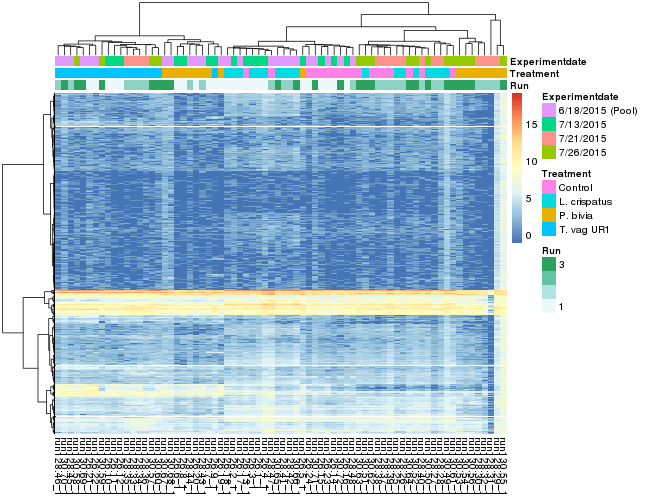 

```r
> positive = grepl("POS", rownames(raw))
> negative = grepl("ANT", rownames(raw))
> hk = grepl("HK", rownames(raw))
> mirs = grepl("miR", rownames(raw)) | grepl("let", rownames(raw))
> 
> dd = melt(raw %>% mutate(id = rownames(raw)), id.vars = "id")
> dd$group = meta[dd$variable, "Treatment"]
> 
> ggplot(dd %>% filter(grepl("POS", id))) + geom_boxplot(aes(y = value, x = variable, 
+     fill = group)) + ggtitle("Positive probes")
```

 

```r
> ggplot(dd %>% filter(grepl("ANT", id))) + geom_boxplot(aes(y = value, x = variable, 
+     fill = group)) + ggtitle("Negative probes") + theme(axis.text = element_text(angle = 90, 
+     hjust = 1))
```

 

Only one sample has a lot of noise in the negative probes. Remove sample 55 (  P. bivia  replicate).

# Normalization

Kept miRNAs with average counts > 70 in any group. Removed samples 55.


```r
> library(DESeq2)
> meta = meta[-55, ]
> raw = raw[, -55]
> no_pooled = !grepl("Pool", meta$Experimentdate)
> clean_meta = meta
> clean_meta$Treatment = gsub(" ", "", clean_meta$Treatment)
> group = as.character(unique(clean_meta$Treatment[no_pooled]))
> clean_raw = raw[grepl("-", rownames(raw)), ]
> cpm = clean_raw
> 
> keep = lapply(group, function(g) {
+     .is = clean_meta$Treatment == g
+     .count_group = rowMeans(cpm[, .is])
+     .count_group > 70
+ })
> idx = apply(do.call(cbind, keep), 1, any)
> all = do.call(cbind, keep)
> colnames(all) = gsub(" ", "", group)
> 
> # mirs = grepl('miR', rownames(raw_f)) | grepl('let', rownames(raw_f))
> raw_f = clean_raw[idx, ]
> dse = DESeqDataSetFromMatrix(raw_f, meta, ~Treatment)
> dse = estimateSizeFactors(dse)
> rlg = rlog(dse)
> # save(rlg,file='rlg.rda') load('rls.rda')
```

Total mirnas 379

## Distribution

```r
> df = melt(assay(rlg))
> df$group = meta$Treatment[match(df$X2, rownames(meta))]
> df$experiment = meta$Experimentdate[match(df$X2, rownames(meta))]
> ggplot(df, aes(x = value, group = X2, color = group)) + geom_density() + facet_wrap(~experiment)
```

 

## Clustering

```r
> ma = assay(rlg)
> mds(ma, d = "cor", condition = meta$Treatment)
```

 

## Heatmap

```r
> meta$Total = log10(colSums(raw_f))
> 
> pheatmap(ma, annotation = meta, clustering_distance_col = .cor(ma), clustering_method = "ward.D2", 
+     show_rownames = FALSE)
```

 

```r
> # pheatmap(ma[positive,], annotation = meta,
> # clustering_distance_col='correlation', clustering_method = 'ward.D2')
```

## Pooled samples

Sorted by average expression.

### All conditions

```r
> pooled = grepl("Pool", meta$Experimentdate)
> pool_cpm = ma[, pooled]
> pool_meta = meta[pooled, ]
> pool_sort = pool_cpm[order(rowMeans(pool_cpm), decreasing = TRUE), ]
> 
> pheatmap(cor(pool_cpm, method = "kendall"), clustering_method = "ward.D2", annotation = pool_meta)
```

 

```r
> pheatmap(pool_sort, annotation = pool_meta, clustering_distance_col = .cor(pool_sort), 
+     clustering_method = "ward.D2", show_rownames = FALSE)
```

 

```r
> pheatmap(pool_sort, annotation = pool_meta[, "Treatment", drop = F], cluster_rows = FALSE, 
+     clustering_distance_col = .cor(pool_sort), clustering_method = "ward.D2", 
+     show_rownames = FALSE)
```

 

### Each condition

```r
> for (cond in unique(pool_meta$Treatment)) {
+     .cond = grepl(cond, pool_meta$Treatment)
+     .pool_cpm = pool_cpm[, .cond]
+     .pool_meta = pool_meta[.cond, ]
+     .pool_sort = .pool_cpm[order(rowMeans(.pool_cpm), decreasing = TRUE), ]
+     pheatmap(.pool_sort, annotation = .pool_meta, cluster_rows = FALSE, clustering_distance_col = .cor(.pool_sort), 
+         clustering_method = "ward.D2", show_rownames = FALSE, main = cond)
+     pheatmap(.pool_sort, cluster_rows = FALSE, clustering_distance_col = .cor(.pool_sort), 
+         clustering_method = "ward.D2", show_rownames = FALSE, main = cond)
+ }
```

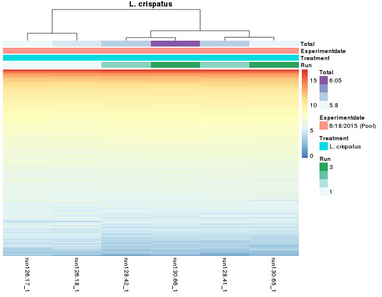      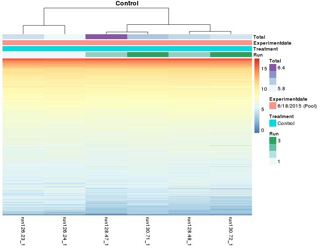  

## Not pooled samples

### All

```r
> library(corrplot)
> pooled = !grepl("Pool", meta$Experimentdate)
> pool_cpm = ma[, pooled]
> pool_meta = meta[pooled, c("Treatment", "Experimentdate")]
> # pool_sort = pool_cpm[order(rowMeans(pool_cpm),decreasing = TRUE),]
> 
> pheatmap(pool_cpm, annotation = pool_meta, clustering_distance_col = .cor(pool_cpm), 
+     clustering_method = "ward.D2", show_rownames = FALSE)
```

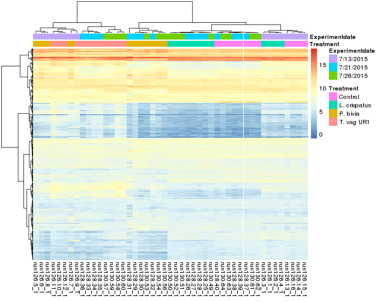 

```r
> pheatmap(pool_cpm, annotation = pool_meta[, "Treatment", drop = F], clustering_distance_col = .cor(pool_cpm), 
+     clustering_method = "ward.D2", show_rownames = FALSE)
```

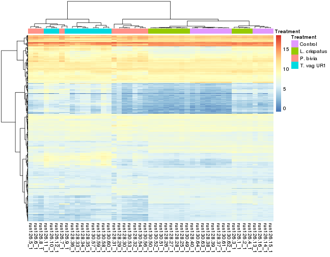 

Correlation values


```r
> pheatmap(cor(pool_cpm, method = "kendall"), clustering_method = "ward.D2", annotation = pool_meta, 
+     annotation_row = pool_meta[, "Treatment", drop = F], main = "correlation values between samples")
```

 

```r
> con_crisp = grepl("Control", pool_meta$Treatment) | grepl("crisp", pool_meta$Treatment)
> # corrplot(cor(pool_cpm[,con_crisp], method='kendall'), method = 'number')
> pheatmap(cor(pool_cpm[, con_crisp], method = "kendall"), clustering_method = "ward.D2", 
+     annotation = pool_meta, annotation_row = pool_meta[, "Treatment", drop = F], 
+     display_numbers = T, main = "correlation values between Control and L.crispatus samples")
```

 

Only for Controls and LCrispatus


```r
> dd = cor(pool_cpm[, con_crisp], method = "kendall")
> colnames(dd) = paste0("D", pool_meta[colnames(dd), "Experimentdate"], "_", pool_meta[colnames(dd), 
+     "Treatment"], "_", 1:nrow(dd))
> rownames(dd) = paste0("D", pool_meta[rownames(dd), "Experimentdate"], "_", pool_meta[rownames(dd), 
+     "Treatment"], "_", 1:nrow(dd))
> dd = melt(dd)
> ggplot(dd %>% filter(grepl("D7/13/2015_L. crispatus", X1) & grepl("L. crispatus", 
+     X2) & !grepl("D7/13/2015", X2)), aes(x = X1, y = X2, fill = 1)) + geom_tile(color = "white") + 
+     scale_fill_continuous(guide = FALSE, low = "white", high = "white") + geom_text(aes(label = round(value, 
+     digits = 2), size = 3)) + theme_bw() + theme(axis.text.x = element_text(angle = 90, 
+     hjust = 1)) + labs(list(title = "correlation among Lcrispatus in different experimental date", 
+     x = "", y = ""))
```

 

```r
> ggplot(dd %>% filter(grepl("D7/13/2015_L. crispatus", X1) & grepl("D7/13/2015_Control", 
+     X2)), aes(x = X1, y = X2, fill = 1)) + geom_tile(color = "white") + scale_fill_continuous(guide = FALSE, 
+     low = "white", high = "white") + geom_text(aes(label = round(value, digits = 2), 
+     size = 3)) + theme_bw() + theme(axis.text.x = element_text(angle = 90, hjust = 1)) + 
+     labs(list(title = "correlation among Lcrispatus and Controls in same experimental date", 
+         x = "", y = ""))
```

 

### Each condition

```r
> library(GGally)
> for (cond in unique(pool_meta$Treatment)) {
+     .cond = grepl(cond, pool_meta$Treatment)
+     .pool_cpm = pool_cpm[, .cond]
+     .pool_meta = pool_meta[.cond, ]
+     # .pool_sort = .pool_cpm[order(rowMeans(.pool_cpm),decreasing = TRUE),]
+     pheatmap(.pool_cpm, annotation = .pool_meta, clustering_distance_col = .cor(.pool_cpm), 
+         clustering_method = "ward.D2", show_rownames = FALSE, main = cond)
+     # dd_cor = data.frame(run1=rowMeans(.pool_cpm[,1:3]),
+     # run2=rowMeans(.pool_cpm[,4:6]), run3=rowMeans(.pool_cpm[,7:9]))
+     # print(ggpairs(.pool_cpm))
+     
+     pheatmap(.pool_cpm, clustering_distance_col = .cor(.pool_cpm), clustering_method = "ward.D2", 
+         show_rownames = FALSE, main = cond)
+ }
```

 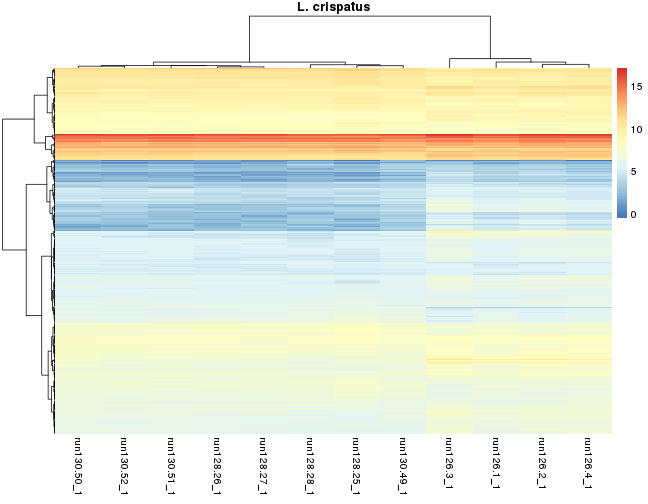     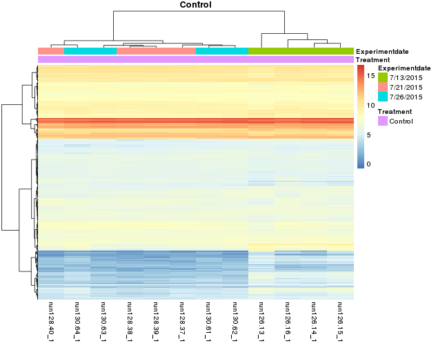  


# Differential expression

```r
> handle_deseq2 = function(dds, summarydata, column) {
+     all_combs = combn(levels(summarydata[, column]), 2, simplify = FALSE)
+     all_results = list()
+     contrast_strings = list()
+     for (comb in all_combs) {
+         if (comb[1] == "Control") 
+             comb = rev(comb)
+         contrast_string = paste(comb, collapse = "_vs_")
+         contrast = c(column, comb)
+         res = results(dds, contrast = contrast)
+         res = res[order(res$padj), ]
+         all_results = c(all_results, res)
+         contrast_strings = c(contrast_strings, contrast_string)
+     }
+     names(all_results) = contrast_strings
+     return(all_results)
+ }
> 
> plot_MA = function(res) {
+     for (i in seq(length(res))) {
+         DESeq2::plotMA(res[[i]])
+         title(paste("MA plot for contrast", names(res)[i]))
+     }
+ }
> 
> plot_volcano = function(res) {
+     for (i in seq(length(res))) {
+         stats = as.data.frame(res[[i]][, c(2, 6)])
+         p = volcano_density_plot(stats, title = names(res)[i], lfc.cutoff = 1)
+         print(p)
+     }
+ }
> plot_gene = function(name, d) {
+     design = colData(d)
+     ggplot(plotCounts(d, name, returnData = TRUE, intgroup = "Treatment", transform = TRUE) %>% 
+         mutate(run = as.factor(design$Run)), aes(x = Treatment, y = count, color = run)) + 
+         geom_point(size = 3) + ggtitle(name) + scale_color_brewer(palette = "Set1")
+ }
```


* Not including pooled samples


```r
> no_pooled = !grepl("Pool", clean_meta$Experimentdate)
> clean_meta$Treatment = relevel(factor(clean_meta$Treatment), ref = "Control")
> dse = DESeqDataSetFromMatrix(raw_f[, no_pooled], clean_meta[no_pooled, ], ~Treatment)
> dse = DESeq(dse)
> plotDispEsts(dse)
```

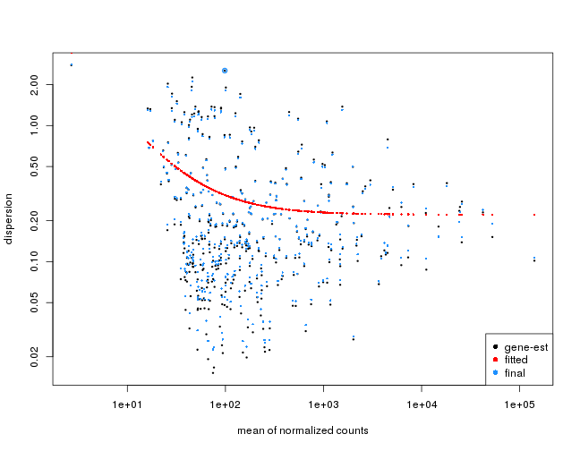 

```r
> res = handle_deseq2(dse, colData(dse), "Treatment")
> plot_MA(res)
```

 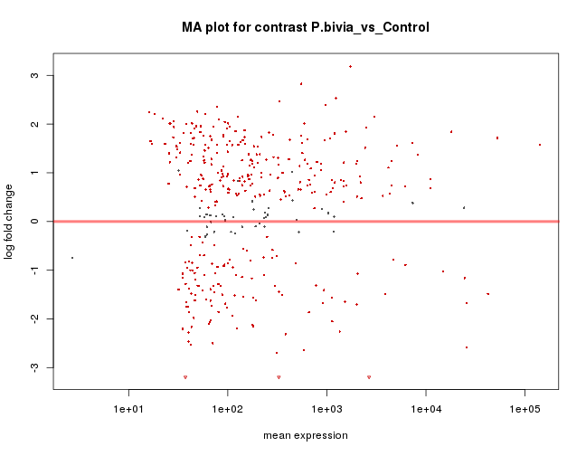   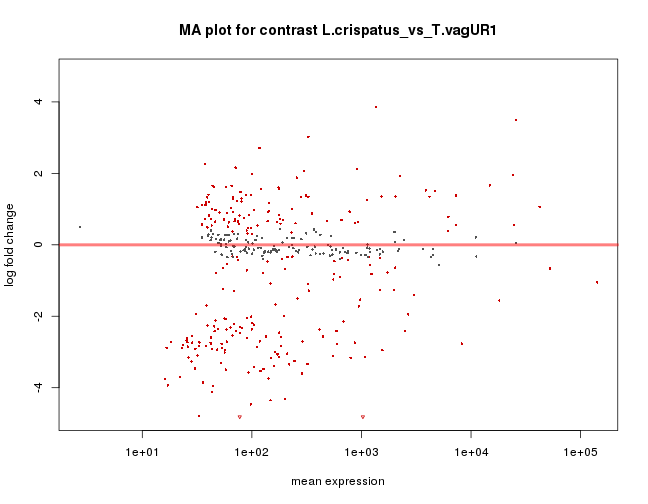  


```r
> for (i in names(res)) {
+     cat("\n\n###Top 20 at: ", i, "\n\n")
+     print(kable(head(res[[i]], 20)))
+     # top = (all_results[[i]] %>% mutate(mir=rownames(all_results[[i]])) %>%
+     # filter(padj<0.1))[,1:5]
+     cat("\n\n")
+     
+     stats = as.data.frame(res[[i]][, c(2, 6)])
+     p = volcano_density_plot(stats, title = i, lfc.cutoff = 1)
+     # suppressMessages(print(p))
+     cat("\n\n")
+     
+     # .plots = lapply(rownames(res[[i]][1:6,]), plot_gene, dse)
+     # do.call(grid.arrange, .plots)
+     i = gsub(" ", "", i)
+     res_tab = cbind(id = rownames(as.data.frame(res[[i]])), as.data.frame(res[[i]]))
+     write.table(res_tab, paste0(i, "_mirna_de.xls"), sep = "\t", quote = F, 
+         row.names = F)
+     cat("\n\n")
+     cat("[Download file](", get_report_links(paste0(i, "_mirna_de.xls")), ")", 
+         sep = "")
+     cat("\n\n")
+ }
```


###Top 20 at:  L.crispatus_vs_Control 


|            |   baseMean| log2FoldChange|     lfcSE|       stat|   pvalue|      padj|
|:-----------|----------:|--------------:|---------:|----------:|--------:|---------:|
|miR-3197    | 2666.91639|     -5.8410543| 0.3366208| -17.352028| 0.00e+00| 0.0000000|
|miR-6845-5p |  586.59323|     -3.6955453| 0.2222862| -16.625168| 0.00e+00| 0.0000000|
|miR-3178    | 3870.56558|     -1.2696557| 0.1894938|  -6.700250| 0.00e+00| 0.0000000|
|miR-4284    |   47.14848|     -2.2105013| 0.3324950|  -6.648224| 0.00e+00| 0.0000000|
|miR-4763-3p |  312.72368|     -1.1500830| 0.1963242|  -5.858080| 0.00e+00| 0.0000004|
|miR-1260b   | 1480.31061|     -0.9955484| 0.1823910|  -5.458319| 0.00e+00| 0.0000030|
|miR-762     | 2230.34925|     -1.0439492| 0.1969453|  -5.300707| 1.00e-07| 0.0000062|
|miR-4651    |  485.78744|     -0.6298760| 0.1349943|  -4.665947| 3.10e-06| 0.0001455|
|miR-1273e   |  935.37811|      1.2682235| 0.2774862|   4.570402| 4.90e-06| 0.0002006|
|miR-1915-3p | 1349.72582|     -1.1681241| 0.2565693|  -4.552861| 5.30e-06| 0.0002006|
|miR-4463    |   97.94760|     -0.6473756| 0.1451788|  -4.459162| 8.20e-06| 0.0002734|
|miR-6756-5p |   67.53605|     -0.6676324| 0.1500891|  -4.448241| 8.70e-06| 0.0002734|
|miR-5196-5p |   72.81821|     -0.7824250| 0.1768946|  -4.423114| 9.70e-06| 0.0002836|
|miR-3135a   |  298.89522|      1.1202741| 0.2597873|   4.312275| 1.62e-05| 0.0004374|
|miR-4440    |   37.38327|     -0.9623034| 0.2252586|  -4.271994| 1.94e-05| 0.0004895|
|miR-4488    | 7288.20036|     -0.8573395| 0.2022224|  -4.239586| 2.24e-05| 0.0005304|
|miR-8072    | 1195.83963|     -0.9017111| 0.2149177|  -4.195612| 2.72e-05| 0.0006067|
|miR-1973    |   40.24331|     -1.3418141| 0.3348450|  -4.007269| 6.14e-05| 0.0012933|
|miR-3665    |  635.57123|     -0.8851177| 0.2221308|  -3.984669| 6.76e-05| 0.0013235|
|miR-6859-5p |  327.81191|     -0.7581567| 0.1906437|  -3.976826| 6.98e-05| 0.0013235|


 


[Download file](http://github.com/lpantano/scripts_hsph/raw/reports/riana_final/L.crispatus_vs_Control_mirna_de.xls)


###Top 20 at:  P.bivia_vs_Control 


|            |    baseMean| log2FoldChange|     lfcSE|       stat| pvalue| padj|
|:-----------|-----------:|--------------:|---------:|----------:|------:|----:|
|miR-6859-5p |   327.81191|      -4.998743| 0.2219517| -22.521761|      0|    0|
|miR-3197    |  2666.91639|      -4.686303| 0.3445714| -13.600382|      0|    0|
|miR-4440    |    37.38327|      -4.096084| 0.3073266| -13.328115|      0|    0|
|miR-4763-3p |   312.72368|      -2.691739| 0.2084610| -12.912434|      0|    0|
|miR-937-5p  |   176.09035|      -2.127600| 0.1807743| -11.769371|      0|    0|
|miR-6845-5p |   586.59323|      -2.646809| 0.2284404| -11.586430|      0|    0|
|miR-4448    | 25656.57294|      -2.584533| 0.2314672| -11.165874|      0|    0|
|miR-4463    |    97.94760|      -1.763239| 0.1617397| -10.901704|      0|    0|
|miR-1910-5p |    35.04204|      -2.205749| 0.2289942|  -9.632339|      0|    0|
|miR-6088    |    59.61391|       2.206047| 0.2298144|   9.599253|      0|    0|
|miR-4507    |   123.17326|      -2.196846| 0.2376489|  -9.244083|      0|    0|
|miR-1290    |  1728.81001|       3.181284| 0.3553632|   8.952204|      0|    0|
|miR-4758-5p |    80.67319|      -1.857404| 0.2082796|  -8.917836|      0|    0|
|miR-6886-3p |    60.35425|      -1.607518| 0.1813580|  -8.863785|      0|    0|
|miR-4539    |    70.49733|      -2.500987| 0.2868977|  -8.717349|      0|    0|
|miR-1915-3p |  1349.72582|      -2.261025| 0.2634978|  -8.580810|      0|    0|
|miR-4726-5p |    45.23941|      -1.980268| 0.2370207|  -8.354832|      0|    0|
|miR-8072    |  1195.83963|       1.808919| 0.2193081|   8.248302|      0|    0|
|miR-920     |   126.14389|       2.147966| 0.2621583|   8.193394|      0|    0|
|miR-1275    |   117.56568|      -1.517662| 0.1855143|  -8.180838|      0|    0|


 


[Download file](http://github.com/lpantano/scripts_hsph/raw/reports/riana_final/P.bivia_vs_Control_mirna_de.xls)


###Top 20 at:  T.vagUR1_vs_Control 


|            |    baseMean| log2FoldChange|     lfcSE|      stat| pvalue| padj|
|:-----------|-----------:|--------------:|---------:|---------:|------:|----:|
|miR-6846-5p |  1030.72805|       9.118960| 0.4221955|  21.59890|      0|    0|
|miR-1915-3p |  1349.72582|      -5.030169| 0.2596012| -19.37652|      0|    0|
|miR-6859-5p |   327.81191|      -3.778572| 0.1975088| -19.13116|      0|    0|
|miR-210-3p  |   164.55345|       1.849364| 0.1019214|  18.14501|      0|    0|
|miR-181c-5p |   104.18247|       4.186941| 0.2325514|  18.00437|      0|    0|
|miR-6845-5p |   586.59323|      -3.562312| 0.2223817| -16.01891|      0|    0|
|miR-4448    | 25656.57294|      -3.586791| 0.2264399| -15.83992|      0|    0|
|miR-181d-5p |    93.19422|       4.200318| 0.2728529|  15.39408|      0|    0|
|miR-762     |  2230.34925|      -2.970217| 0.1977773| -15.01799|      0|    0|
|miR-17-3p   |    57.80656|       3.741571| 0.2543463|  14.71054|      0|    0|
|miR-3178    |  3870.56558|      -2.790898| 0.1897541| -14.70797|      0|    0|
|miR-320b    |   176.99712|       3.046740| 0.2175499|  14.00479|      0|    0|
|miR-181b-5p |   120.12048|       3.957461| 0.2871081|  13.78387|      0|    0|
|miR-320c    |   170.73599|       3.028645| 0.2214000|  13.67952|      0|    0|
|miR-4429    |   210.46841|       3.078850| 0.2260698|  13.61903|      0|    0|
|miR-320a    |   244.71307|       3.122552| 0.2315300|  13.48660|      0|    0|
|miR-221-3p  |   867.45043|       3.025338| 0.2255256|  13.41461|      0|    0|
|miR-4463    |    97.94760|      -2.045978| 0.1537734| -13.30515|      0|    0|
|miR-181a-5p |   286.47894|       4.207995| 0.3238883|  12.99212|      0|    0|
|miR-320e    |   162.51365|       2.771243| 0.2132711|  12.99400|      0|    0|


 


[Download file](http://github.com/lpantano/scripts_hsph/raw/reports/riana_final/T.vagUR1_vs_Control_mirna_de.xls)


###Top 20 at:  L.crispatus_vs_P.bivia 


|            |    baseMean| log2FoldChange|     lfcSE|       stat| pvalue| padj|
|:-----------|-----------:|--------------:|---------:|----------:|------:|----:|
|miR-6859-5p |   327.81191|       4.240586| 0.2222449|  19.080690|      0|    0|
|miR-8072    |  1195.83963|      -2.710630| 0.2196401| -12.341238|      0|    0|
|miR-4488    |  7288.20036|      -2.474932| 0.2066856| -11.974383|      0|    0|
|miR-1260b   |  1480.31061|      -2.206322| 0.1866085| -11.823264|      0|    0|
|miR-1275    |   117.56568|       2.018697| 0.1847162|  10.928644|      0|    0|
|miR-4448    | 25656.57294|       2.490956| 0.2314675|  10.761578|      0|    0|
|miR-937-5p  |   176.09035|       1.881081| 0.1810081|  10.392249|      0|    0|
|miR-1237-5p |   566.59865|      -2.100688| 0.2040065| -10.297162|      0|    0|
|miR-5787    |  2438.29231|      -2.409910| 0.2365417| -10.188101|      0|    0|
|miR-4440    |    37.38327|       3.133780| 0.3096962|  10.118886|      0|    0|
|miR-3960    | 52629.77957|      -2.589975| 0.2588383| -10.006153|      0|    0|
|miR-6126    |  3000.88432|      -3.368283| 0.3540685|  -9.513082|      0|    0|
|miR-6786-5p |   635.32157|      -1.759745| 0.1879784|  -9.361420|      0|    0|
|miR-1273e   |   935.37811|       2.677438| 0.2863986|   9.348643|      0|    0|
|miR-1290    |  1728.81001|      -3.278794| 0.3553820|  -9.226110|      0|    0|
|miR-3135a   |   298.89522|       2.439184| 0.2711700|   8.995037|      0|    0|
|miR-920     |   126.14389|      -2.359613| 0.2627264|  -8.981254|      0|    0|
|miR-4507    |   123.17326|       2.088220| 0.2377652|   8.782699|      0|    0|
|miR-638     |   560.24494|      -2.033876| 0.2326490|  -8.742251|      0|    0|
|miR-4800-3p |   261.43536|      -2.661442| 0.3103264|  -8.576266|      0|    0|


 


[Download file](http://github.com/lpantano/scripts_hsph/raw/reports/riana_final/L.crispatus_vs_P.bivia_mirna_de.xls)


###Top 20 at:  L.crispatus_vs_T.vagUR1 


|            |    baseMean| log2FoldChange|     lfcSE|      stat| pvalue| padj|
|:-----------|-----------:|--------------:|---------:|---------:|------:|----:|
|miR-6846-5p |  1030.72805|      -9.161359| 0.4224408| -21.68673|      0|    0|
|miR-210-3p  |   164.55345|      -1.674811| 0.1008543| -16.60624|      0|    0|
|miR-4448    | 25656.57294|       3.493213| 0.2264403|  15.42664|      0|    0|
|miR-6859-5p |   327.81191|       3.020415| 0.1978399|  15.26697|      0|    0|
|miR-181c-5p |   104.18247|      -3.421753| 0.2248124| -15.22048|      0|    0|
|miR-1275    |   117.56568|       2.707493| 0.1794766|  15.08549|      0|    0|
|miR-1915-3p |  1349.72582|       3.862045| 0.2597079|  14.87072|      0|    0|
|miR-320b    |   176.99712|      -3.144316| 0.2178615| -14.43264|      0|    0|
|miR-320a    |   244.71307|      -3.254225| 0.2318621| -14.03518|      0|    0|
|miR-320e    |   162.51365|      -3.000238| 0.2141832| -14.00782|      0|    0|
|miR-17-3p   |    57.80656|      -3.494477| 0.2506490| -13.94172|      0|    0|
|miR-320c    |   170.73599|      -3.067983| 0.2214679| -13.85295|      0|    0|
|miR-4429    |   210.46841|      -3.044993| 0.2258755| -13.48085|      0|    0|
|miR-181d-5p |    93.19422|      -3.575648| 0.2664746| -13.41834|      0|    0|
|miR-6850-5p |   281.21288|       1.332586| 0.1027647|  12.96735|      0|    0|
|miR-181b-5p |   120.12048|      -3.533632| 0.2841552| -12.43557|      0|    0|
|miR-221-3p  |   867.45043|      -2.739753| 0.2252997| -12.16048|      0|    0|
|miR-320d    |   149.16410|      -3.176510| 0.2627213| -12.09080|      0|    0|
|miR-149-5p  |    56.54314|      -3.015968| 0.2530325| -11.91929|      0|    0|
|miR-193a-5p |    30.28515|      -3.465187| 0.2998101| -11.55794|      0|    0|


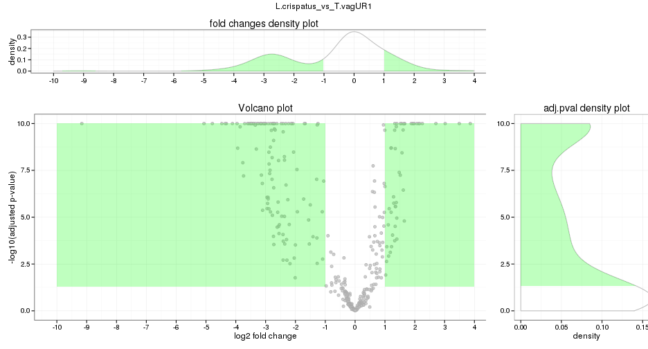 


[Download file](http://github.com/lpantano/scripts_hsph/raw/reports/riana_final/L.crispatus_vs_T.vagUR1_mirna_de.xls)


###Top 20 at:  P.bivia_vs_T.vagUR1 


|            |    baseMean| log2FoldChange|     lfcSE|       stat| pvalue| padj|
|:-----------|-----------:|--------------:|---------:|----------:|------:|----:|
|miR-6846-5p |  1030.72805|     -8.9466921| 0.4471951| -20.006238|      0|    0|
|miR-4488    |  7288.20036|      3.8568299| 0.2068861|  18.642282|      0|    0|
|miR-762     |  2230.34925|      3.4463143| 0.2023082|  17.034968|      0|    0|
|miR-6085    |   100.37738|      3.0382968| 0.1909340|  15.912808|      0|    0|
|miR-8069    |   257.46285|      2.8607018| 0.2118035|  13.506398|      0|    0|
|miR-6089    |  4172.60750|      2.5039208| 0.2207946|  11.340500|      0|    0|
|miR-5787    |  2438.29231|      2.5411039| 0.2366094|  10.739656|      0|    0|
|miR-197-5p  |    74.67544|      1.2665232| 0.1217562|  10.402124|      0|    0|
|miR-1915-3p |  1349.72582|      2.7691441| 0.2665495|  10.388857|      0|    0|
|miR-6771-5p |   118.32938|     -3.3217411| 0.3359639|  -9.887196|      0|    0|
|miR-8072    |  1195.83963|      2.1450289| 0.2194731|   9.773540|      0|    0|
|miR-181c-5p |   104.18247|     -2.2426012| 0.2299819|  -9.751207|      0|    0|
|miR-17-3p   |    57.80656|     -2.4854013| 0.2566759|  -9.683032|      0|    0|
|miR-210-3p  |   164.55345|     -0.9784956| 0.1047334|  -9.342727|      0|    0|
|miR-4466    | 24243.82540|      2.3674081| 0.2620037|   9.035782|      0|    0|
|miR-6727-5p |    77.42498|      1.5751655| 0.1824073|   8.635431|      0|    0|
|miR-6803-5p |   182.57662|      1.4071839| 0.1668880|   8.431905|      0|    0|
|miR-320b    |   176.99712|     -1.8670095| 0.2232616|  -8.362431|      0|    0|
|miR-6786-5p |   635.32157|      1.5451081| 0.1879599|   8.220413|      0|    0|
|miR-1237-5p |   566.59865|      1.6449433| 0.2037940|   8.071600|      0|    0|


 


[Download file](http://github.com/lpantano/scripts_hsph/raw/reports/riana_final/P.bivia_vs_T.vagUR1_mirna_de.xls)

## Alternative strategy to detect ON/OFF

I think a valid strategy would be to do the 70 cut off by group.
So I keep mirnas that have average of 70 in any of the groups and then do the 
differential expression analysis. The ones with padj < 0.05 are good candidates 
to on/off assuming 70 as the cutoff for expression/non expression.


```r
> onoff_de = c()
> for (i in names(res)) {
+     if (grepl("Control", i)) {
+         .g = unlist(strsplit(i, "_"))
+         .g1 = match(.g[1], colnames(all))
+         .g2 = match(.g[3], colnames(all))
+         .onoff = row.names(res[[i]]) %in% rownames(all[rowSums(all[, c(.g1, 
+             .g2)]) == 1 & all[, .g2] == 0, ])
+         .res = res[[i]][.onoff, ]
+         .res = .res[.res$padj < 0.05, ]
+         cat("\n\n###", .g[3], ". Top 10 (total", nrow(.res), "):\n\n")
+         print(kable(head(.res, 10)))
+         cat("\n\n")
+         # top = (all_results[[i]] %>% mutate(mir=rownames(all_results[[i]])) %>%
+         # filter(padj<0.1))[,1:5] .plots = lapply(rownames(.res[1:3,]), plot_gene,
+         # dse) do.call(grid.arrange, .plots)
+         i = gsub(" ", "", i)
+         res_tab = cbind(id = rownames(as.data.frame(.res)), as.data.frame(.res))
+         write.table(res_tab, paste0(i, "_mirna_onoff_de.xls"), sep = "\t", quote = F, 
+             row.names = F)
+         cat("\n\n")
+         cat("[Download file](", get_report_links(paste0(i, "_mirna_onoff_de.xls")), 
+             ")", sep = "")
+         cat("\n\n")
+         onoff_de = c(onoff_de, rownames(.res[.res$padj < 0.05, ]))
+     }
+ }
```


### Control . Top 10 (total 1 ):


|           | baseMean| log2FoldChange|     lfcSE|     stat|    pvalue|      padj|
|:----------|--------:|--------------:|---------:|--------:|---------:|---------:|
|miR-605-3p | 79.03184|      0.5479492| 0.1969009| 2.782869| 0.0053881| 0.0352082|


[Download file](http://github.com/lpantano/scripts_hsph/raw/reports/riana_final/L.crispatus_vs_Control_mirna_onoff_de.xls)


### Control . Top 10 (total 47 ):


|            |  baseMean| log2FoldChange|     lfcSE|     stat|  pvalue|     padj|
|:-----------|---------:|--------------:|---------:|--------:|-------:|--------:|
|miR-6088    |  59.61391|      2.2060467| 0.2298144| 9.599253| 0.0e+00| 0.00e+00|
|miR-181c-5p | 104.18247|      1.9443396| 0.2466705| 7.882336| 0.0e+00| 0.00e+00|
|miR-378i    |  77.41477|      1.5792930| 0.2386062| 6.618826| 0.0e+00| 0.00e+00|
|miR-181b-5p | 120.12048|      1.8529149| 0.3003336| 6.169523| 0.0e+00| 0.00e+00|
|miR-378a-3p | 104.06482|      1.6509199| 0.2703746| 6.106046| 0.0e+00| 0.00e+00|
|miR-4665-5p |  58.62400|      1.2066641| 0.2024615| 5.959969| 0.0e+00| 0.00e+00|
|miR-3937    |  89.91453|      1.1276355| 0.2134787| 5.282191| 1.0e-07| 5.00e-07|
|miR-4795-5p |  68.42107|      1.1755875| 0.2378419| 4.942726| 8.0e-07| 2.50e-06|
|miR-605-3p  |  79.03184|      0.9982327| 0.2046058| 4.878808| 1.1e-06| 3.30e-06|
|miR-5000-5p |  86.44085|      1.0461588| 0.2273787| 4.600952| 4.2e-06| 1.16e-05|


[Download file](http://github.com/lpantano/scripts_hsph/raw/reports/riana_final/P.bivia_vs_Control_mirna_onoff_de.xls)


### Control . Top 10 (total 89 ):


|            |   baseMean| log2FoldChange|     lfcSE|     stat| pvalue| padj|
|:-----------|----------:|--------------:|---------:|--------:|------:|----:|
|miR-6846-5p | 1030.72805|       9.118960| 0.4221955| 21.59890|      0|    0|
|miR-181c-5p |  104.18247|       4.186941| 0.2325514| 18.00437|      0|    0|
|miR-181d-5p |   93.19422|       4.200318| 0.2728529| 15.39408|      0|    0|
|miR-17-3p   |   57.80656|       3.741571| 0.2543463| 14.71054|      0|    0|
|miR-181b-5p |  120.12048|       3.957461| 0.2871081| 13.78387|      0|    0|
|miR-149-5p  |   56.54314|       3.060536| 0.2537906| 12.05930|      0|    0|
|miR-96-5p   |   21.99085|       5.115968| 0.4373479| 11.69771|      0|    0|
|miR-125a-5p |  159.23323|       3.455535| 0.3140506| 11.00312|      0|    0|
|miR-100-5p  |   43.16886|       4.174300| 0.3955502| 10.55315|      0|    0|
|miR-33a-5p  |   30.50375|       3.653758| 0.3480543| 10.49766|      0|    0|


[Download file](http://github.com/lpantano/scripts_hsph/raw/reports/riana_final/T.vagUR1_vs_Control_mirna_onoff_de.xls)


Heatmap with all onoff detected:


```r
> onoff_rlg = assay(rlog(dse))
> pheatmap(onoff_rlg[unique(onoff_de), ], clustering_distance_col = .cor(onoff_rlg), 
+     clustering_method = "ward.D2", annotation = clean_meta, show_rownames = FALSE, 
+     main = "ON/OFF mirnas")
```

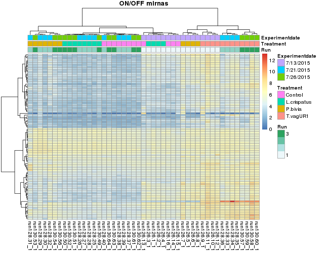 

```r
> pheatmap(onoff_rlg[unique(onoff_de), ], clustering_distance_col = .cor(onoff_rlg), 
+     clustering_method = "ward.D2", annotation = clean_meta[, "Treatment", drop = F], 
+     show_rownames = FALSE, main = "ON/OFF mirnas")
```

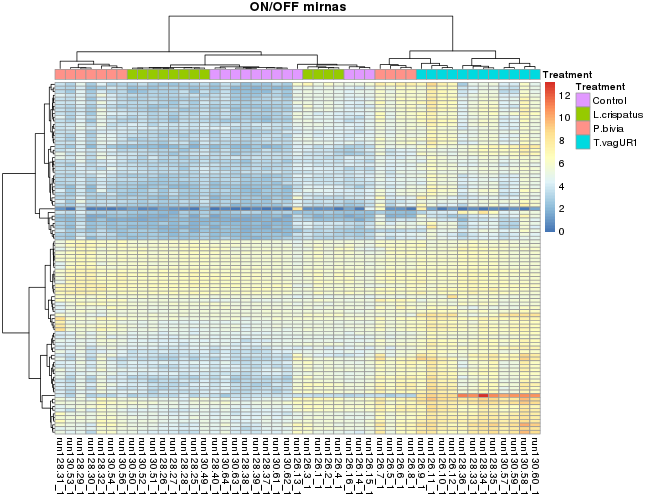 


# Files requested

## heatmaps of pooled samples

[heatmap of pooled samples](http://github.com/lpantano/scripts_hsph/raw/reports/riana_final/figure/heatmap-pooled-2.png)

## heatmaps of non-pooled samples

### Each condition
[heatmap of non pooled samples from L.Crispatus](http://github.com/lpantano/scripts_hsph/raw/reports/riana_final/figure/heatmap-nopooled-condition-2.png)

[heatmap of non pooled samples from P.bivia](http://github.com/lpantano/scripts_hsph/raw/reports/riana_final/figure/heatmap-nopooled-condition-4.png)

[heatmap of non pooled samples from T.Vag UR1](http://github.com/lpantano/scripts_hsph/raw/reports/riana_final/figure/heatmap-nopooled-condition-6.png)

[heatmap of non pooled samples from Control](http://github.com/lpantano/scripts_hsph/raw/reports/riana_final/figure/heatmap-nopooled-condition-8.png)

### All together
[heatmap of non pooled samples all together](http://github.com/lpantano/scripts_hsph/raw/reports/riana_final/figure/heatmap-nopooled-2.png)

## Differential expression tables and volcano plots

[download table with differential expressed genes of L.crispatus_vs_Control](http://github.com/lpantano/scripts_hsph/raw/reports/riana_final/L.crispatus_vs_Control_mirna_de.xls)

[download volcano plot of L.crispatus_vs_Control_mirna_de.xls](http://github.com/lpantano/scripts_hsph/raw/reports/riana_final/figure/nonpooled-de-volcano-1.png)

[download table with differential expressed genes of L.crispatus_vs_P.bivia](http://github.com/lpantano/scripts_hsph/raw/reports/riana_final/L.crispatus_vs_P.bivia_mirna_de.xls)

[download volcano plot of L.crispatus_vs_P.bivia_mirna_de.xls](http://github.com/lpantano/scripts_hsph/raw/reports/riana_final/figure/nonpooled-de-volcano-2.png)

[download table with differential expressed genes of L.crispatus_vs_T.vagUR1](http://github.com/lpantano/scripts_hsph/raw/reports/riana_final/L.crispatus_vs_T.vagUR1_mirna_de.xls)

[download volcano plot of L.crispatus_vs_T.vagUR1_mirna_de.xls](http://github.com/lpantano/scripts_hsph/raw/reports/riana_final/figure/nonpooled-de-volcano-3.png)

[download table with differential expressed genes of P.bivia_vs_Control](http://github.com/lpantano/scripts_hsph/raw/reports/riana_final/P.bivia_vs_Control_mirna_de.xls)

[download volcano plot of P.bivia_vs_Control_mirna_de.xls](http://github.com/lpantano/scripts_hsph/raw/reports/riana_final/figure/nonpooled-de-volcano-4.png)

[download table with differential expressed genes of P.bivia_vs_T.vagUR1](http://github.com/lpantano/scripts_hsph/raw/reports/riana_final/P.bivia_vs_T.vagUR1_mirna_de.xls)

[download volcano plot of P.bivia_vs_T.vagUR1_mirna_de.xls](http://github.com/lpantano/scripts_hsph/raw/reports/riana_final/figure/nonpooled-de-volcano-5.png)

[download table with differential expressed genes of T.vagUR1_vs_Control](http://github.com/lpantano/scripts_hsph/raw/reports/riana_final/T.vagUR1_vs_Control_mirna_de.xls)

[download volcano plot of T.vagUR1_vs_Control_mirna_de.xls](http://github.com/lpantano/scripts_hsph/raw/reports/riana_final/figure/nonpooled-de-volcano-6.png)

## On/Off miRNAs

[download table with onn/off genes of L.crispatus_vs_Control_mirna](http://github.com/lpantano/scripts_hsph/raw/reports/riana_final/L.crispatus_vs_Control_mirna_onoff_de.xls)

[download table with onn/off genes of P.bivia_vs_Control_mirna](http://github.com/lpantano/scripts_hsph/raw/reports/riana_final/P.bivia_vs_Control_mirna_onoff_de.xls)

[download table with onn/off genes of T.vagUR1_vs_Control_mirna](http://github.com/lpantano/scripts_hsph/raw/reports/riana_final/T.vagUR1_vs_Control_mirna_onoff_de.xls)

