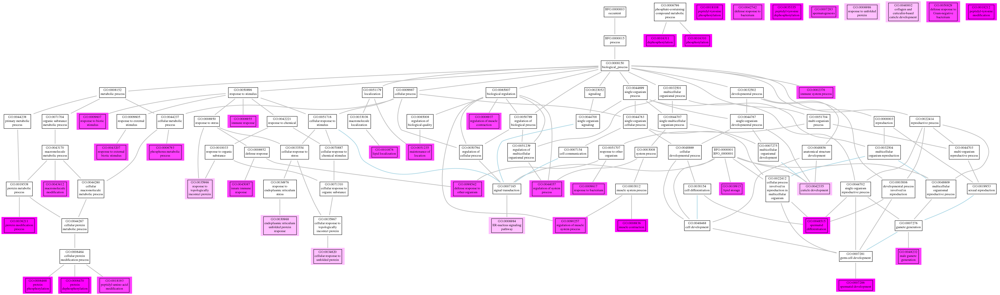
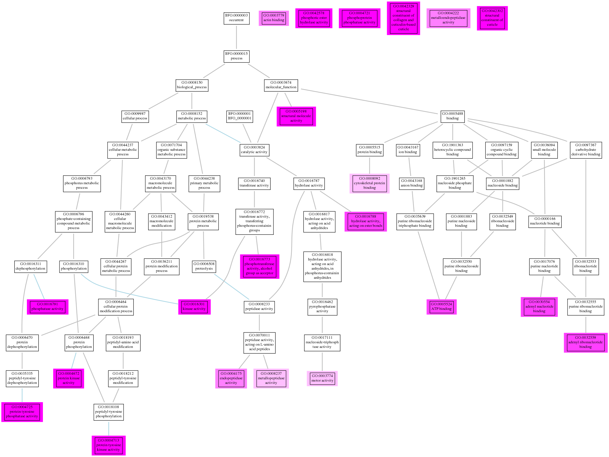
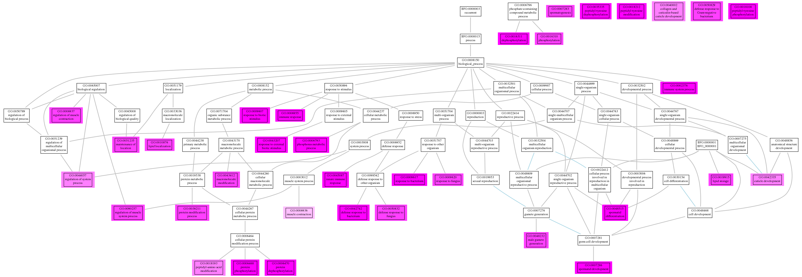
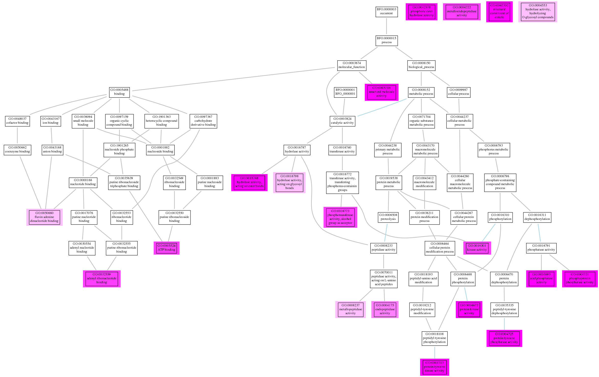
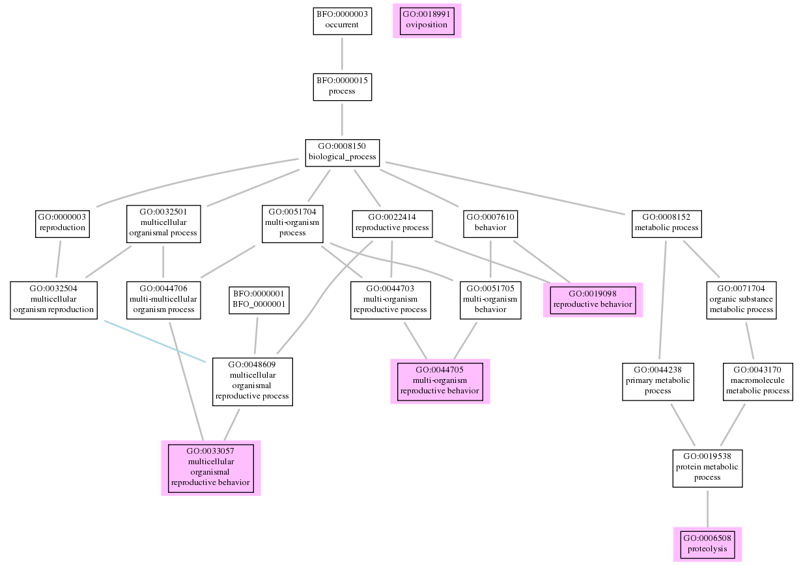
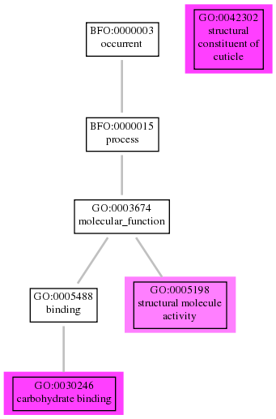

---
output:
  knitrBootstrap::bootstrap_document:
    theme: readable
    highlight: zenburn
    theme.chooser: TRUE
    highlight.chooser: TRUE
  html_document:
    toc: true
    highlight: zenburn
---

```{r setup, echo=FALSE}
library(rmarkdown)
library(knitr)
knitr::opts_chunk$set(tidy=TRUE, highlight=TRUE, dev="png",
               cache=TRUE, highlight=TRUE, autodep=TRUE, warning=FALSE, error=FALSE,
               message=FALSE, prompt=TRUE, comment='', fig.cap='', bootstrap.show.code=FALSE,
               cache.path = "~/.cache/slack_celegans")
source("~/repos/myRfunctions/transactions.R")
dn <- "slack_mirna_mrna"
root_path<-"~/repos/pipelines/slack_cel_network/reports"
setwd(root_path)
```

```{r render,eval=FALSE}
render_2_drop("~/repos/pipelines/slack_cel_network/reports/mrna.Rmd",dn)
```

# Overview

## Methods

* we used bcbio to run all the samples (https://bcbio-nextgen.readthedocs.org/)
* the GO enrichment functions can be found here (https://github.com/hbc/CHBUtils/blob/master/R/runGO.R). 
it was used the standard function `hyperGTest` with a pvalue = 0.05. The FDR was calculated with
`p.adjust` functin. Only terms inside this condition were selected `fdr<0.1 & Count > 5 & OddsRatio > 1.5 )`:
FDR < 10%, more than 5 genes, and Odds ratio > 1.5


```{r qc-setup}
library(ggplot2)
library(reshape)
library(gplots)
library(edgeR)
library(CHBUtils)
project_summary = "/home/lpantano/orch/scratch/celegans_network/celegans_network_raw/celegans_mrna/mrna/res/2014-10-15_mrna/project-summary.csv"
counts_file = "/home/lpantano/orch/scratch/celegans_network/celegans_network_raw/celegans_mrna/mrna/res/2014-10-15_mrna/combined.counts"
cbPalette <- c("#999999", "#E69F00", "#56B4E9", "#009E73", "#F0E442",
"#0072B2", "#D55E00", "#CC79A7")
summarydata = read.table(project_summary, header=TRUE, sep=",")
rownames(summarydata) = summarydata$Name
summarydata = summarydata[order(rownames(summarydata)),]
counts = read.table(counts_file, header=TRUE, row.names="id")
counts = counts[, order(colnames(counts))]
```

# Quality control metrics

## Mapped reads
```{r mapped-plot}
ggplot(summarydata, aes(x=Name, y=Mapped)) + 
    geom_bar(stat="identity") +
    theme(axis.text.x = element_text(angle = 90)) +
    ylab("mapped reads") + xlab("")
```

## Genomic mapping rate
```{r mapping-rate-plot}
ggplot(summarydata, aes(x=Name, y=Mapping.Rate)) + 
    geom_bar(stat="identity") +
    theme(axis.text.x = element_text(angle = 90)) +
    ylab("mapping rate") + xlab("")
```

## Number of genes detected
```{r genes-detected-plot}
ggplot(summarydata, aes(x=Name, y=Genes.Detected)) +
    geom_bar(stat="identity") +
    theme(axis.text.x = element_text(angle = 90)) + 
    ylab("genes detected") + xlab("")
```

## Exonic mapping rate
```{r exonic-mapping-plot}
ggplot(summarydata, aes(x=Name, y=Exonic.Rate)) + 
    geom_bar(stat="identity") +
    theme(axis.text.x = element_text(angle = 90)) +
    ylab("exonic mapping rate") + xlab("")
```

## rRNA mapping rate
```{r rRNA-rate-plot}
ggplot(summarydata, aes(x=Name, y=rRNA.rate)) + 
    geom_bar(stat="identity") +
    theme(axis.text.x = element_text(angle = 90)) +
    ylab("rRNA rate") + xlab("")
```

## Estimated fragment length of paired-end reads
```{r fragment-length-plot}
ggplot(summarydata, aes(x=Name, y=Fragment.Length.Mean)) + 
    geom_bar(stat="identity") +
    theme(axis.text.x = element_text(angle = 90)) +
    ylab("fragment length") + xlab("")
```

## Boxplot of log10 counts per gene
```{r boxplot-raw}
melted = melt(counts)
colnames(melted) = c("sample", "count")
melted$sample = factor(melted$sample)
melted$sample = reorder(melted$sample, colnames(counts))
melted$count = log(melted$count)
ggplot(melted, aes(x=sample, y=count)) + geom_boxplot() +
  theme(axis.text.x = element_text(angle = 90, hjust = 1)) + xlab("")
```

## Correlation heatmap of raw counts
```{r heatmap-raw}
p = ggheatmap(cor(counts))
ggheatmap.show(p)
```

## Boxplot of log10 TMM-normalized counts per gene
Trimmed mean of M-values (TMM) normalization is described
[here](http://genomebiology.com/2010/11/3/R25)

Robinson, M. D., & Oshlack, A. (2010). A scaling normalization method for differential expression analysis of RNA-seq data. Genome Biology, 11(3). doi:10.1186/gb-2010-11-3-r25

```{r boxplot-normalized}
y = DGEList(counts=counts)
y = calcNormFactors(y)
normalized_counts = cpm(y, normalized.lib.sizes=TRUE)
melted = melt(normalized_counts)
colnames(melted) = c("gene", "sample", "count")
melted$sample = factor(melted$sample)
melted$sample = reorder(melted$sample, colnames(counts))
melted$count = log(melted$count)
ggplot(melted, aes(x=sample, y=count)) + geom_boxplot() +
  theme(axis.text.x = element_text(angle = 90, hjust = 1)) + xlab("")
```

## Correlation heatmap of TMM-normalized counts
```{r heatmap-normalized}
p = ggheatmap(cor(normalized_counts))
ggheatmap.show(p)
```

## Correlation (Spearman) heatmap of TMM-normalized counts
```{r spearman-heatmap-normalized}
p = ggheatmap(cor(normalized_counts, method="spearman"))
ggheatmap.show(p)
```

## Correlation (Spearman) heatmap of TMM-normalized log2(counts)
```{r spearman-heatmap-normalized-log2}
p = ggheatmap(cor(log2(normalized_counts+0.5), method="spearman"))
ggheatmap.show(p)
```


## MDS plot of TMM-normalized counts
```{r mds-normalized}
mds(normalized_counts, k=5,
    condition = summarydata$time ,d = "cor", xi=1, yi=3) +
    scale_color_brewer(palette = "Set1")
```

## Heatmap of top 30 most expressed genes
```{r top-count-genes, results='asis'}
select = order(rowMeans(counts),decreasing=TRUE)[1:30]
p = ggheatmap(as.matrix(log2(counts[select,])))
ggheatmap.show(p)
```

```{r de-setup}
library(DESeq2)
library(vsn)
design = ~ time + type
condition = "type"
dataset = "celegans_gene_ensembl"
filter = "ensembl_gene_id"
symbol = "external_gene_name"
entres <- "entrezgene"
```

# Differential expression
```{r deseq2-expression-analysis, results='asis'}
counts <- counts[rowSums(counts>1)>2,]
summarydata$conditions <- paste0(summarydata$type,summarydata$time)
dds = DESeqDataSetFromMatrix(countData=counts,
    colData=summarydata, design = ~ conditions)
dds = DESeq(dds)
resultsNames(dds)
```

## Effect of variance stabilization
```{r deseq-diagnostics, results='asis'}
par(mfrow=c(1,3))
notAllZero <- (rowSums(counts(dds))>0)
rld <- rlog(dds)
vsd <- varianceStabilizingTransformation(dds)
rlogMat <- assay(rld)
vstMat <- assay(vsd)
write.table(rlogMat,paste0(root_path,"/rlog_mat.txt"), quote=F,sep="\t")
meanSdPlot(log2(counts(dds,normalized=TRUE)[notAllZero,] + 1),
           ylim = c(0,2.5))
meanSdPlot(assay(rld[notAllZero,]), ylim = c(0,2.5))
meanSdPlot(assay(vsd[notAllZero,]), ylim = c(0,2.5))
```

## Dispersion estimates
```{r dispersion-estimate}
plotDispEsts(dds)
```

## Results
```{r ann}
annotate_df = function(df, dataset, filter, symbol) {
  require(biomaRt)
  ensembl = useMart('ensembl', dataset = dataset)
  annot.df = getBM(attributes=c(filter, symbol), filters=c(filter), values=rownames(df),
                   mart=ensembl)
  m = merge(df, annot.df, by.x="row.names", by.y=filter)
  colnames(m)[1] = "id"
  return(m)
}

```


## Specific genes

### INS-7
```{r ins-7}
dd <- summarydata[, c("Name", "type", "time")]
dd$exp = rlogMat["WBGene00002090",]
ggplot(dd, aes(y=exp, x=time, colour=type)) +
    geom_point()
```


## N2 along time

```{r N2-time}
res <- results(dds, contrast = c("conditions","N2Day5","N2Day0"))
DESeq::plotMA(as.data.frame(res))
res_nona <- res[!is.na(res$padj),]
keep <- res_nona$padj < 0.01 & abs(res_nona$log2FoldChange)>2 & res_nona$baseMean>20
out_df <- annotate_df(data.frame(res_nona[keep,]), dataset, filter, symbol)
write.table(out_df,"n2_de_genes.txt",sep="\t")
knitr::kable(head(out_df))
```

Download complete table [get](n2_de_genes.txt)


```{r go-set,cache=TRUE, results='asis'}
library(org.Ce.eg.db)
set <- universeGO(org.Ce.egGO,"Caenorhabditis elegans")
```

### GO enrichment analysis

```{r go}
keep_entrez <- annotate_df(data.frame(res_nona[keep,]), dataset, filter, entres)
top50<- keep_entrez$entrezgene
g.entrez <- as.character(top50[!is.na(top50)])
bp<- runGO(g.entrez,set,"BP",as.list(GOBPCHILDREN))
plotGO(bp, 'bp_content', 'png' )
write.table(bp[[1]], "N2_along_time_BP_GO.txt")
mf<-runGO(g.entrez,set,"MF",as.list(GOMFCHILDREN))
plotGO(mf, 'mf_content')
write.table(mf[[1]], "N2_along_time_MF_GO.txt")
```

[MF](N2_along_time_MF_GO.txt) and [BP](N2_along_time_BP_GO.txt) tables.

BP:
<a href="bp_content.png"></a>

MF:
<a href="mf_content.png"></a>

## KO along time

```{r KO-time}
res <- results(dds, contrast = c("conditions","mir.71Day5","mir.71Day0"))
DESeq::plotMA(as.data.frame(res))
res_nona <- res[!is.na(res$padj),]
keep <- res_nona$padj < 0.01 & abs(res_nona$log2FoldChange)>2 & res_nona$baseMean>20
out_df <- annotate_df(data.frame(res_nona[keep,]), dataset, filter, symbol)
write.table(out_df,"ko_de_genes.txt",sep="\t")
knitr::kable(head(out_df))
```

Download complete table [get](ko_de_genes.txt)

### GO enrichment analysis

```{r go-ko}
keep_entrez <- annotate_df(data.frame(res_nona[keep,]), dataset, filter, entres)
top50<- keep_entrez$entrezgene
g.entrez <- as.character(top50[!is.na(top50)])
bp<- runGO(g.entrez,set,"BP",as.list(GOBPCHILDREN))
plotGO(bp, 'ko_bp_content', 'png' )
write.table(bp[[1]], "KO_along_time_BP_GO.txt")
mf<-runGO(g.entrez,set,"MF",as.list(GOMFCHILDREN))
plotGO(mf, 'ko_mf_content')
write.table(mf[[1]], "KO_along_time_MF_GO.txt")
```

[MF](KO_along_time_MF_GO.txt) and [BP](KO_along_time_BP_GO.txt) tables.

BP:
<a href="ko_bp_content.png"></a>

MF:
<a href="ko_mf_content.png"></a>

## Difference among N2-KO along time

positive FC should be UP in N2 and Day5 

```{r interaction}
summarydata$type = factor(summarydata$type, levels=c("mir-71","N2"))
summarydata$time = factor(summarydata$time, levels=c("Day0","Day5"))
summarydata$conditions <- paste0(summarydata$type,summarydata$time)
dds = DESeqDataSetFromMatrix(countData=counts,
    colData=summarydata, design = ~ time*type)
dds = DESeq(dds)
resultsNames(dds)
res <- results(dds, name = "timeDay5.typeN2")
DESeq::plotMA(as.data.frame(res))
res_nona <- res[!is.na(res$padj),]
keep <- res_nona$padj < 0.01 & res_nona$baseMean>20
out_df <- annotate_df(data.frame(res_nona[keep,]), dataset, filter, symbol)
write.table(out_df,"n2_vs_ko_along_time_de_genes.txt",sep="\t")
knitr::kable(head(out_df))
```

Download complete table [get](n2_vs_ko_along_time_de_genes.txt)


### Go enrichment

```{r go-n2-ko-time}
keep_entrez <- annotate_df(data.frame(res_nona[keep,]), dataset, filter, entres)
top50<- keep_entrez$entrezgene
g.entrez <- as.character(top50[!is.na(top50)])
bp<- runGO(g.entrez,set,"BP",as.list(GOBPCHILDREN))
plotGO(bp, 'n2kotime_bp_content', 'png' )
write.table(mf[[1]], "N2KO_along_time_BP_GO.txt")
mf<-runGO(g.entrez,set,"MF",as.list(GOMFCHILDREN))
plotGO(mf, 'n2kotime_mf_content')
write.table(mf[[1]], "N2KO_along_time_MF_GO.txt")
```

[MF](N2KO_along_time_MF_GO.txt) and [BP](N2KO_along_time_BP_GO.txt) tables.

BP:
<a href="n2kotime_bp_content.png"></a>

MF:
<a href="n2kotime_mf_content.png"></a>

## Difference among N2-KO

N2 vs KO

```{r interaction-n2-ko}
res <- results(dds, name = "type_N2_vs_mir.71")
DESeq::plotMA(as.data.frame(res))
res_nona <- res[!is.na(res$padj),]
keep <- res_nona$padj < 0.1 & res_nona$baseMean>20
out_df <- annotate_df(data.frame(res_nona[keep,]), dataset, filter, symbol)
write.table(out_df,"n2_vs_ko_de_genes.txt",sep="\t")
knitr::kable(head(out_df))
```

Download complete table [get](n2_vs_ko_de_genes.txt)

### Go enrichment

```{r go-n2-ko}
keep_entrez <- annotate_df(data.frame(res_nona[keep,]), dataset, filter, entres)
top50<- keep_entrez$entrezgene
g.entrez <- as.character(top50[!is.na(top50)])
#bp<- runGO(g.entrez,set,"BP",as.list(GOBPCHILDREN))
#plotGO(bp, 'n2ko_bp_content', 'png' )
#mf<-runGO(g.entrez,set,"MF",as.list(GOMFCHILDREN))
#plotGO(mf, 'n2ko_mf_content')
```

No significant results, maybe try another web tool

```{r copy-txt-png}
copy_batch_2_drop('.txt$', dn)
copy_batch_2_drop('.png$', dn)
```

# Conclusions

Conclusions showed at miRNA report.